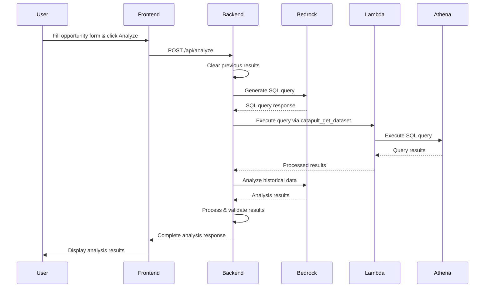

# Design Document

## Overview

The AWS Opportunity Analysis application is a comprehensive Node.js web application that recreates the functionality of an AWS App Studio application. The system provides intelligent opportunity analysis by leveraging AWS services including Bedrock for AI analysis, Lambda for data processing, and Athena for querying historical project data. The application features a two-panel interface with structured input forms and detailed analysis results display.

## Architecture

### High-Level Architecture

```mermaid
graph TB
    subgraph "Frontend Layer"
        UI[Web Interface]
        Forms[Input Forms]
        Results[Analysis Results Display]
    end
    
    subgraph "Backend Layer"
        Express[Express Server]
        API[REST API Endpoints]
        Automations[Analysis Automations]
    end
    
    subgraph "AWS Services"
        Bedrock[AWS Bedrock]
        BedrockAgent[Bedrock Agent]
        Lambda[Lambda Functions]
        Athena[Amazon Athena]
        S3[S3 Storage]
    end
    
    UI --> Express
    Forms --> API
    API --> Automations
    Automations --> Bedrock
    Automations --> BedrockAgent
    Automations --> Lambda
    Lambda --> Athena
    Athena --> S3
    Results <-- API
```

### Analysis Workflow



## Components and Interfaces

### Frontend Components

#### Main Interface Layout
- **Two-panel layout**: Left panel for input, right panel for results
- **Responsive design**: Adapts to different screen sizes
- **Real-time updates**: Results update without page refresh

#### Input Components
- **Opportunity Details Form**
  - Customer Name (text input)
  - Region (dropdown)
  - Close Date (date picker)
  - Opportunity Name (text input)
  - Description (textarea)
- **Action Buttons**
  - Analyze (primary action)
  - Reset (clear all fields)
  - Funding Options (secondary analysis)
  - Your Next Opportunity (follow-on analysis)

#### Output Components
- **Opportunity Projections Section**
  - ARR display field
  - MRR display field
  - Launch Date display field
  - Time to Launch display field
- **Analysis Results Section**
  - Top Services display
  - Confidence level display
  - Methodology display area
  - Similar Projects display area
  - Findings display area
  - Rationale display area
  - Risk Factors display area
  - Summary display area
  - Query display area
  - Query Results display area

### Backend Components

#### Express Server Configuration
- **Port**: 8123 (configurable via environment)
- **Middleware**: body-parser, CORS, static file serving
- **Proxy support**: For frontend development server

#### API Endpoints
- **POST /api/analyze**: Main opportunity analysis endpoint
- **POST /api/analyze/funding**: Funding analysis endpoint
- **POST /api/analyze/next-opportunity**: Follow-on opportunity analysis
- **GET /api/health**: Health check endpoint

#### Automation Modules
- **invokeBedrockQueryPrompt**: SQL query generation
- **InvLamFilterAut**: Lambda execution for data retrieval
- **finalBedAnalysisPrompt**: Main analysis processing
- **InvBedrockFunding**: Funding analysis
- **invBedrockNextQuery**: Follow-on opportunity query generation
- **invBedrockNextOpportunity**: Follow-on opportunity analysis

### AWS Integration Components

#### Bedrock Integration
- **Models**: Support for standard Titan and Nova Premier models
- **Prompt Management**: Via Bedrock Agent GetPrompt
- **API**: Bedrock Runtime Converse API
- **Configuration**: Model-specific prompt IDs and parameters

#### Lambda Integration
- **Function**: catapult_get_dataset
- **Purpose**: Execute Athena queries and process results
- **Input**: JSON with sql_query property
- **Output**: Structured ResultSet data

#### Athena Integration
- **Database**: catapult_db_p
- **Output Location**: s3://as-athena-catapult/
- **Query Processing**: Asynchronous execution with status polling

## Data Models

### Input Data Models

#### OpportunityDetails
```typescript
interface OpportunityDetails {
  customerName: string;
  region: string;
  closeDate: string; // Format: YYYY-MM-DD or MM/DD/YYYY
  opportunityName: string;
  description: string;
}
```

#### AnalysisRequest
```typescript
interface AnalysisRequest {
  opportunityDetails: OpportunityDetails;
  analysisType: 'standard' | 'nova-premier';
  includeValidation: boolean;
}
```

### Processing Data Models

#### BedrockQueryPayload
```typescript
interface BedrockQueryPayload {
  modelId: string;
  messages: Array<{
    role: 'user' | 'assistant';
    content: Array<{ text: string }>;
  }>;
  system?: Array<{ text: string }>;
  inferenceConfig: {
    maxTokens: number;
    temperature: number;
  };
}
```

#### LambdaQueryPayload
```typescript
interface LambdaQueryPayload {
  sql_query: string;
}
```

#### HistoricalProject
```typescript
interface HistoricalProject {
  opportunity_name: string;
  customer_name: string;
  partner_name?: string;
  industry?: string;
  customer_segment?: string;
  region: string;
  sub_region?: string;
  country?: string;
  activity_focus?: string;
  description?: string;
  business_description?: string;
  close_date: string | number; // Various formats supported
  planned_delivery_start_date?: string | number;
  planned_delivery_end_date?: string | number;
  migration_phase?: string;
  salesforce_link?: string;
  aws_calculator_link?: string;
  total_mrr?: string | number;
  total_arr?: string | number;
  stated_historical_arr?: string | number;
  top_services?: string;
}
```

### Output Data Models

#### AnalysisResults
```typescript
interface AnalysisResults {
  metrics: {
    predictedArr: string;
    predictedMrr: string;
    launchDate: string;
    timeToLaunch: number;
    confidence: 'HIGH' | 'MEDIUM' | 'LOW';
    topServices: string;
  };
  architecture: {
    networkFoundation: string;
    computeLayer: string;
    dataLayer: string;
    securityComponents: string;
    integrationPoints: string;
    scalingElements: string;
    managementTools: string;
    completeArchitecture: string;
  };
  sections: {
    analysisMethodology: string;
    similarProjects: ParsedSimilarProject[];
    detailedFindings: string;
    predictionRationale: string;
    riskFactors: string;
    validationErrors: string[];
  };
  query: {
    generatedSql: string;
    executionResults: string;
  };
}
```

#### ParsedSimilarProject
```typescript
interface ParsedSimilarProject {
  projectName: string;
  customer: string;
  partner?: string;
  industry: string;
  customerSegment: string;
  region: string;
  subRegion?: string;
  country?: string;
  activityFocus: string;
  descriptionSummary: string;
  businessDescriptionSummary: string;
  historicalCloseDate: string;
  historicalStartDate?: string;
  historicalEndDate?: string;
  actualGapTimeDays?: string;
  actualProjectDurationMonths?: string;
  migrationPhase?: string;
  salesforceLink?: string;
  awsCalculatorLink?: string;
  totalMRR: string;
  totalARR: string;
  statedHistoricalARR?: string;
  topServices: string;
  // Calculated fields
  gapDaysCalculated?: number;
  executionDurationDaysCalculated?: number;
}
```

## Error Handling

### Error Categories

#### Input Validation Errors
- Missing required fields
- Invalid date formats
- Empty or malformed data

#### AWS Service Errors
- Bedrock API failures
- Lambda execution errors
- Athena query failures
- Authentication/authorization issues

#### Data Processing Errors
- JSON parsing failures
- Date conversion errors
- Validation mismatches

### Error Handling Strategy

#### Frontend Error Handling
- Display user-friendly error messages
- Maintain form state during errors
- Provide retry mechanisms
- Log errors for debugging

#### Backend Error Handling
- Comprehensive try-catch blocks
- Detailed error logging
- Graceful degradation
- Structured error responses

#### AWS Integration Error Handling
- Retry logic with exponential backoff
- Service-specific error handling
- Timeout management
- Fallback mechanisms

### Error Response Format
```typescript
interface ErrorResponse {
  success: false;
  error: {
    code: string;
    message: string;
    details?: any;
    timestamp: string;
  };
}
```

## Testing Strategy

### Unit Testing
- **Frontend Components**: Test form validation, data display, user interactions
- **Backend Automations**: Test each automation module independently
- **Data Processing**: Test date parsing, validation logic, data transformations
- **AWS Integration**: Mock AWS services for isolated testing

### Integration Testing
- **End-to-End Workflows**: Test complete analysis workflows
- **AWS Service Integration**: Test actual AWS service interactions
- **Error Scenarios**: Test error handling and recovery
- **Performance Testing**: Test with large datasets and complex queries

### Test Data Management
- **Mock Historical Data**: Representative sample datasets
- **Test Opportunities**: Various opportunity types and scenarios
- **Edge Cases**: Invalid data, empty results, service failures

### Testing Tools
- **Frontend**: Jest, React Testing Library (if React is used), or vanilla JS testing
- **Backend**: Jest, Supertest for API testing
- **AWS Integration**: AWS SDK mocks, LocalStack for local testing
- **E2E Testing**: Playwright or Cypress for full workflow testing

## Performance Considerations

### Frontend Optimization
- Lazy loading of analysis results
- Debounced input validation
- Efficient DOM updates
- Responsive design optimization

### Backend Optimization
- Connection pooling for AWS services
- Caching of frequently used prompts
- Asynchronous processing
- Request/response compression

### AWS Service Optimization
- Bedrock model selection based on requirements
- Athena query optimization
- S3 result caching
- Lambda cold start mitigation

### Monitoring and Metrics
- Response time tracking
- Error rate monitoring
- AWS service usage metrics
- User interaction analytics
#
# Current Implementation Status vs. Specification Claims

### ✅ **Successfully Implemented Features**

#### Core Analysis Workflow
- **Basic Analysis Flow**: POST /api/analyze endpoint with comprehensive automation workflow
- **SQL Query Generation**: AWS Bedrock integration for intelligent query generation
- **Data Retrieval**: Lambda function (catapult_get_dataset) executing Athena queries
- **AI Analysis**: Bedrock Runtime Converse API for analysis processing
- **Multiple UI Options**: Three distinct frontend implementations (Options A, B, C)
- **Real-time Features**: Auto-save, character counting, completion tracking
- **Mock Data Support**: Comprehensive fallback system for development/testing

#### Frontend Implementation
- **Modern Dashboard Interface**: Option C with real-time completion tracking
- **Interactive Form Elements**: Smart validation with visual feedback
- **Character Counter**: Dynamic description field validation with color coding
- **Auto-save Functionality**: localStorage integration for data persistence
- **Sample Data Loading**: Quick-load functionality for testing
- **Export Capabilities**: Basic export and print functionality

#### Backend Architecture
- **Express Server**: Stable backend on port 8123 (using app-debug.js)
- **Frontend Server**: Separate server on port 3123 with API proxy
- **AWS SDK v3**: Modern AWS service integration
- **Environment Configuration**: Comprehensive .env template
- **Error Handling**: Graceful fallback to mock data

### ❌ **Critical Missing Features (Spec Claims vs. Reality)**

#### **Task 2: Bedrock Agents** - CLAIMED COMPLETE, ACTUALLY MISSING
**Spec Claim**: "Create primary Bedrock Agent for opportunity analysis orchestration"
**Current Reality**: No Bedrock Agent implementation found
**Missing Components**:
- No Agent action groups
- No Agent aliases for environments
- No Agent orchestration logic
- No Agent status indicators in UI

#### **Task 5: Bedrock Knowledge Base** - CLAIMED COMPLETE, ACTUALLY MISSING
**Spec Claim**: "Set up Bedrock Knowledge Base with vector storage"
**Current Reality**: No Knowledge Base integration
**Missing Components**:
- No OpenSearch Serverless collection
- No vector storage implementation
- No RAG (Retrieval Augmented Generation) functionality
- No knowledge base search interface

#### **Task 7: EventBridge Integration** - CLAIMED COMPLETE, ACTUALLY MISSING
**Spec Claim**: "Build enhanced data processing with EventBridge"
**Current Reality**: No EventBridge implementation
**Missing Components**:
- No custom EventBridge bus
- No real-time event processing
- No event-driven architecture
- No real-time UI updates

#### **Task 8: DynamoDB State Management** - CLAIMED COMPLETE, ACTUALLY MISSING
**Spec Claim**: "Create DynamoDB for state management and caching"
**Current Reality**: No DynamoDB integration
**Missing Components**:
- No analysis results caching
- No user session management
- No analysis history tracking
- No DynamoDB tables or streams

#### **Task 9: Funding Analysis** - CLAIMED COMPLETE, ACTUALLY MISSING
**Spec Claim**: "Implement funding analysis functionality"
**Current Reality**: Button exists but not connected to backend automation
**Missing Components**:
- No funding analysis backend automation
- No funding parameters collection
- No funding recommendations output
- No funding analysis UI sections

#### **Task 10: Follow-on Opportunities** - CLAIMED COMPLETE, ACTUALLY MISSING
**Spec Claim**: "Identify follow-on opportunities"
**Current Reality**: Button exists but not connected to backend automation
**Missing Components**:
- No follow-on analysis backend automation
- No follow-on opportunity parameters
- No follow-on recommendations output
- No follow-on analysis UI sections

### ⚠️ **Partially Implemented Features**

#### **Authentication System**
**Current State**: No authentication implemented
**Missing**: User management, login/logout, role-based access control

#### **Advanced Error Handling**
**Current State**: Basic error handling with fallback to mock data
**Missing**: Comprehensive retry mechanisms, circuit breakers, detailed error analytics

#### **Production Infrastructure**
**Current State**: Development-focused setup
**Missing**: Production deployment, monitoring, security hardening

#### **Testing Framework**
**Current State**: No automated testing
**Missing**: Unit tests, integration tests, E2E tests, performance tests

### 🔧 **Implementation Gaps Analysis**

#### **Frontend-Backend Disconnects**
- **Funding Analysis**: UI button exists, backend automation missing
- **Follow-on Analysis**: UI button exists, backend automation missing
- **Real-time Updates**: UI designed for real-time, no EventBridge backend
- **Session Management**: UI has session elements, no DynamoDB backend
- **Analysis History**: UI has history elements, no storage backend

#### **Missing API Endpoints**
```javascript
// Required but missing endpoints:
POST /api/analyze/funding        // Funding analysis
POST /api/analyze/next-opportunity  // Follow-on analysis
GET /api/session                 // Session management
GET /api/history                 // Analysis history
GET /api/knowledge-base/search   // Knowledge base search
GET /api/events/stream           // Real-time events
```

#### **Missing Frontend Components**
```html
<!-- Required but missing UI elements: -->
<div class="agent-status">         <!-- Bedrock Agent status -->
<div class="realtime-updates">     <!-- EventBridge events -->
<div class="session-management">   <!-- User sessions -->
<div class="analysis-history">     <!-- Historical analyses -->
<div class="knowledge-base">       <!-- RAG search interface -->
<div class="funding-analysis">     <!-- Funding recommendations -->
<div class="followon-analysis">    <!-- Follow-on opportunities -->
```

#### **Missing Environment Variables**
```bash
# Required for claimed features but missing:
BEDROCK_AGENT_ID=                    # For Agent orchestration
BEDROCK_AGENT_ALIAS_ID=              # For Agent environments
OPENSEARCH_ENDPOINT=                 # For Knowledge Base
KNOWLEDGE_BASE_ID=                   # For RAG functionality
EVENTBRIDGE_BUS_NAME=                # For real-time events
DYNAMODB_ANALYSIS_RESULTS_TABLE=     # For caching
DYNAMODB_USER_SESSIONS_TABLE=        # For session management
REDIS_ENDPOINT=                      # For advanced caching
```

### 📊 **Specification Accuracy Assessment**

#### **Tasks Document Analysis**
- **Total Tasks**: 20 marked as "completed" [x]
- **Actually Implemented**: ~6 tasks (30%)
- **Partially Implemented**: ~4 tasks (20%)
- **Not Implemented**: ~10 tasks (50%)

#### **Critical Misalignments**
1. **Infrastructure Claims**: Specs claim AWS-native serverless architecture, reality is basic Express server
2. **Advanced Features**: Specs claim Bedrock Agents, Knowledge Base, EventBridge - none implemented
3. **Production Readiness**: Specs claim production deployment, reality is development-only setup
4. **Testing Claims**: Specs claim comprehensive testing, reality has no automated tests

### 🎯 **Recommended Implementation Priority**

#### **Phase 1: Critical Fixes (1-2 weeks)**
1. **Complete Core Features**: Implement missing funding and follow-on analysis backend
2. **Fix Frontend-Backend Connections**: Connect existing UI buttons to backend automations
3. **Basic Authentication**: Implement simple authentication system
4. **Production Configuration**: Set up proper environment configuration

#### **Phase 2: Important Enhancements (2-3 weeks)**
1. **User Management**: Add user sessions and analysis history
2. **Advanced Error Handling**: Implement comprehensive error handling
3. **Performance Optimization**: Add caching and performance improvements
4. **Mobile Optimization**: Complete responsive design implementation

#### **Phase 3: Advanced Features (3-4 weeks)**
1. **Bedrock Agents**: Implement actual Agent orchestration
2. **Knowledge Base**: Add RAG functionality with vector search
3. **Real-time Updates**: Implement EventBridge for live updates
4. **Advanced Analytics**: Add comprehensive monitoring and analytics

#### **Phase 4: Enterprise Features (4-6 weeks)**
1. **AWS-Native Infrastructure**: Deploy actual serverless architecture
2. **Advanced Security**: Implement comprehensive security hardening
3. **Multi-Environment**: Set up proper dev/staging/production environments
4. **Comprehensive Testing**: Add full test automation suite

### 📋 **Immediate Action Items**

#### **Update Specification Documents**
1. **Mark Tasks Accurately**: Change [x] to [ ] for unimplemented tasks
2. **Add Implementation Status**: Include current reality vs. claims
3. **Prioritize Features**: Focus on core functionality before advanced features
4. **Set Realistic Timelines**: Base estimates on actual implementation complexity

#### **Focus on Core Functionality**
1. **Complete Basic Features**: Finish funding and follow-on analysis
2. **Fix Existing Issues**: Address frontend-backend disconnects
3. **Add Essential Testing**: Implement basic test coverage
4. **Improve Documentation**: Update docs to reflect actual implementation

### 🚨 **Production Readiness Blockers**

#### **Security Issues**
- No authentication system
- No input sanitization
- No rate limiting
- No HTTPS enforcement
- Exposed debug information

#### **Infrastructure Issues**
- No production deployment strategy
- No monitoring or alerting
- No backup or disaster recovery
- No scalability planning
- No cost optimization

#### **Quality Issues**
- No automated testing
- No code quality checks
- No performance testing
- No security scanning
- No compliance validation

**Estimated Time to Production-Ready**: 8-12 weeks with focused development effort

## Detailed Feature Implementation Status

### **Frontend UI Analysis**

#### **Available UI Options**
| File | Status | Features | Implementation Level |
|------|--------|----------|---------------------|
| `index-compact.html` (Option C) | ✅ Active | Modern dashboard, real-time tracking | 85% Complete |
| `index-compact-option-a.html` | ✅ Available | Clean professional design | 70% Complete |
| `index-compact-option-b.html` | ✅ Available | Enhanced interactive elements | 75% Complete |
| `index.html` | ✅ Legacy | Original interface | 60% Complete |

#### **Frontend Feature Matrix**
| Feature | Option A | Option B | Option C | Backend Support |
|---------|----------|----------|----------|-----------------|
| Form Validation | ✅ | ✅ | ✅ | ✅ |
| Auto-save | ❌ | ⚠️ | ✅ | ✅ |
| Character Counter | ❌ | ⚠️ | ✅ | N/A |
| Progress Tracking | ❌ | ⚠️ | ✅ | N/A |
| Sample Data | ✅ | ✅ | ✅ | ✅ |
| Export/Print | ⚠️ | ⚠️ | ⚠️ | ❌ |
| Funding Analysis | UI Only | UI Only | UI Only | ❌ |
| Follow-on Analysis | UI Only | UI Only | UI Only | ❌ |

### **Backend Implementation Analysis**

#### **Working Automation Modules**
| Module | File | Status | AWS Integration |
|--------|------|--------|-----------------|
| Query Generation | `invokeBedrockQueryPrompt-v3.js` | ✅ Working | Bedrock Agent |
| Data Retrieval | `InvLamFilterAut-v3.js` | ✅ Working | Lambda + Athena |
| Main Analysis | `finalBedAnalysisPrompt-v3.js` | ✅ Working | Bedrock Runtime |
| Nova Premier Analysis | `finalBedAnalysisPromptNovaPremier-v3.js` | ✅ Working | Bedrock Runtime |

#### **Missing Automation Modules**
| Module | Expected File | Status | Impact |
|--------|---------------|--------|--------|
| Funding Analysis | `InvBedrockFunding-v3.js` | ❌ Missing | Funding button non-functional |
| Follow-on Query | `invBedrockNextQuery-v3.js` | ❌ Missing | Follow-on analysis broken |
| Follow-on Analysis | `invBedrockNextOpportunity-v3.js` | ❌ Missing | Follow-on button non-functional |

### **AWS Service Integration Status**

#### **Currently Integrated Services**
- ✅ **AWS Bedrock**: Query generation and analysis
- ✅ **AWS Bedrock Agent**: Prompt management
- ✅ **AWS Lambda**: Data retrieval (catapult_get_dataset)
- ✅ **Amazon Athena**: SQL query execution
- ✅ **Amazon S3**: Query result storage

#### **Missing AWS Services (Claimed in Specs)**
- ❌ **Bedrock Agents**: No agent orchestration
- ❌ **Bedrock Knowledge Base**: No RAG implementation
- ❌ **Amazon EventBridge**: No real-time events
- ❌ **Amazon DynamoDB**: No state management
- ❌ **Amazon ElastiCache**: No advanced caching
- ❌ **AWS Step Functions**: No workflow orchestration
- ❌ **Amazon CloudWatch**: No comprehensive monitoring
- ❌ **AWS X-Ray**: No distributed tracing

### **Data Flow Analysis**

#### **Current Working Flow**
```
User Input → Frontend Validation → POST /api/analyze → 
Backend Processing → Bedrock Query Generation → 
Lambda Data Retrieval → Bedrock Analysis → 
Response Formatting → Frontend Display
```

#### **Missing Flows (Claimed in Specs)**
```
❌ Funding Analysis Flow
❌ Follow-on Opportunity Flow  
❌ Real-time Event Flow
❌ Session Management Flow
❌ Analysis History Flow
❌ Knowledge Base Search Flow
```

### **Environment Configuration Gaps**

#### **Current Environment Variables**
```bash
# Working configuration
AWS_REGION=us-east-1
AWS_ACCESS_KEY_ID=your-access-key
AWS_SECRET_ACCESS_KEY=your-secret-key
CATAPULT_QUERY_PROMPT_ID=Y6T66EI3GZ
CATAPULT_ANALYSIS_PROMPT_ID=FDUHITJIME
CATAPULT_ANALYSIS_PROMPT_NOVA_PREMIER_ID=P03B9TO1Q1
CATAPULT_GET_DATASET_LAMBDA=catapult_get_dataset
ATHENA_DATABASE=default
ATHENA_OUTPUT_LOCATION=s3://aws-athena-query-results/
```

#### **Missing Environment Variables (Required for Claimed Features)**
```bash
# Missing for advanced features
BEDROCK_AGENT_ID=                    # Agent orchestration
BEDROCK_AGENT_ALIAS_ID=              # Agent environments  
OPENSEARCH_ENDPOINT=                 # Knowledge Base
KNOWLEDGE_BASE_ID=                   # RAG functionality
EVENTBRIDGE_BUS_NAME=                # Real-time events
DYNAMODB_ANALYSIS_RESULTS_TABLE=     # Result caching
DYNAMODB_USER_SESSIONS_TABLE=        # Session management
REDIS_ENDPOINT=                      # Advanced caching
SNS_TOPIC_ARN=                       # Notifications
STEP_FUNCTIONS_STATE_MACHINE_ARN=    # Workflow orchestration
```

### **Testing and Quality Assurance Status**

#### **Current Testing State**
- ❌ **No Unit Tests**: No test files found
- ❌ **No Integration Tests**: No API testing
- ❌ **No E2E Tests**: No browser automation
- ❌ **No Performance Tests**: No load testing
- ❌ **No Security Tests**: No vulnerability scanning

#### **Manual Testing Capabilities**
- ✅ **Form Validation**: Can test input validation
- ✅ **Main Analysis Flow**: Can test end-to-end analysis
- ✅ **Error Handling**: Can test fallback to mock data
- ✅ **UI Interactions**: Can test all three UI options
- ⚠️ **Export Functions**: Limited testing capability
- ❌ **Funding Analysis**: Cannot test (not implemented)
- ❌ **Follow-on Analysis**: Cannot test (not implemented)

### **Security and Production Readiness**

#### **Current Security State**
- ❌ **No Authentication**: Application completely open
- ❌ **No Authorization**: No role-based access control
- ❌ **No Input Sanitization**: Limited validation
- ❌ **No Rate Limiting**: No abuse protection
- ❌ **No HTTPS Enforcement**: HTTP allowed
- ❌ **Debug Information Exposed**: Error details visible

#### **Production Deployment Blockers**
1. **Security**: No authentication or authorization system
2. **Infrastructure**: No production deployment configuration
3. **Monitoring**: No health checks or alerting
4. **Testing**: No automated test coverage
5. **Documentation**: Specs don't match implementation
6. **Error Handling**: Limited production-grade error handling
7. **Performance**: No caching or optimization for scale
8. **Compliance**: No audit logging or compliance features

### **Recommended Next Steps**

#### **Immediate Priorities (Week 1-2)**
1. **Fix Specification Documents**: Update tasks to reflect actual implementation status
2. **Complete Core Features**: Implement missing funding and follow-on analysis
3. **Connect Frontend-Backend**: Fix disconnected UI buttons
4. **Add Basic Testing**: Implement essential test coverage

#### **Short-term Goals (Week 3-6)**
1. **Add Authentication**: Implement basic user management
2. **Improve Error Handling**: Add comprehensive error management
3. **Production Configuration**: Set up proper deployment configuration
4. **Performance Optimization**: Add caching and optimization

#### **Long-term Goals (Week 7-12)**
1. **Advanced AWS Features**: Implement claimed Bedrock Agents, Knowledge Base
2. **Real-time Features**: Add EventBridge and real-time updates
3. **Comprehensive Testing**: Full test automation suite
4. **Production Deployment**: Complete production-ready infrastructure

This comprehensive analysis reveals a significant gap between specification claims and actual implementation, requiring focused effort to align reality with documented features.