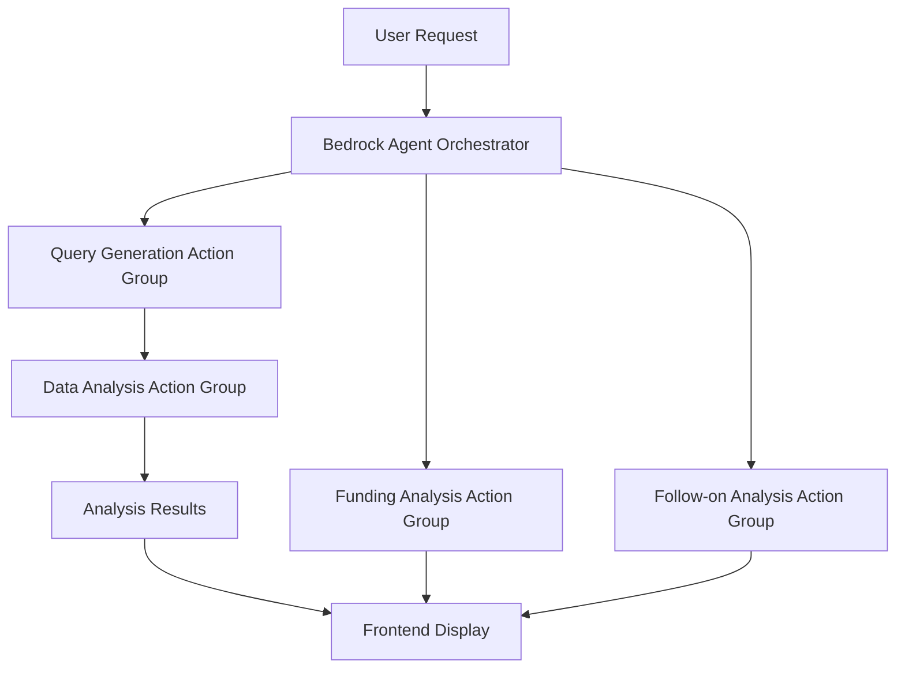

# Bedrock Agent Implementation Guide

## Overview

This guide covers the implementation of AWS Bedrock Agents for intelligent orchestration in the AWS Opportunity Analysis application. The Bedrock Agent system replaces traditional automation workflows with intelligent agent-based orchestration.

## Architecture

### Bedrock Agent Components

1. **Primary Agent**: `opportunity-analysis-orchestrator`
   - Coordinates the entire analysis workflow
   - Manages action group execution
   - Provides intelligent decision-making

2. **Action Groups**:
   - `query-generation`: Generates SQL queries for historical data
   - `data-analysis`: Analyzes historical data and generates predictions
   - `funding-analysis`: Analyzes funding options
   - `follow-on-analysis`: Identifies follow-on opportunities

3. **Lambda Functions**:
   - `bedrock-agent-query-generation`: Handles SQL query generation
   - `bedrock-agent-data-analysis`: Processes data analysis
   - `bedrock-agent-funding-analysis`: Manages funding analysis
   - `bedrock-agent-follow-on-analysis`: Identifies follow-on opportunities

### Agent Workflow



## Deployment

### Prerequisites

1. AWS CLI configured with appropriate permissions
2. Node.js 18+ installed
3. Required environment variables set in `.env`

### Step 1: Deploy Infrastructure

```bash
# Deploy the CDK stack with Bedrock Agent resources
npm run cdk:deploy
```

### Step 2: Deploy Bedrock Agent

```bash
# Deploy the Bedrock Agent and action groups
npm run bedrock-agent:deploy
```

### Step 3: Validate Deployment

```bash
# Validate the agent deployment
npm run bedrock-agent:validate
```

## Configuration

### Environment Variables

Add these to your `.env` file after deployment:

```env
# Bedrock Agent Configuration
BEDROCK_AGENT_ID=your-agent-id
BEDROCK_AGENT_ROLE_ARN=arn:aws:iam::account:role/BedrockAgentRole
BEDROCK_AGENT_DEV_ALIAS=dev-alias-id
BEDROCK_AGENT_STAGING_ALIAS=staging-alias-id
BEDROCK_AGENT_PROD_ALIAS=prod-alias-id

# Existing Bedrock Prompt IDs
CATAPULT_QUERY_PROMPT_ID=Y6T66EI3GZ
CATAPULT_ANALYSIS_PROMPT_ID=FDUHITJIME
CATAPULT_ANALYSIS_PROMPT_NOVA_PREMIER_ID=P03B9TO1Q1

# Lambda Function
CATAPULT_GET_DATASET_LAMBDA=catapult_get_dataset
```

### Agent Aliases

The system creates three aliases for different environments:

- **Development**: For testing and development
- **Staging**: For pre-production testing
- **Production**: For live operations

## Usage

### Frontend Integration

The frontend now supports Bedrock Agent orchestration:

```javascript
// Use Bedrock Agent for analysis
const response = await fetch('/api/analyze', {
  method: 'POST',
  headers: { 'Content-Type': 'application/json' },
  body: JSON.stringify({
    CustomerName: 'Example Corp',
    region: 'us-east-1',
    closeDate: '2024-12-31',
    oppName: 'Cloud Migration',
    oppDescription: 'Migrate legacy systems to AWS',
    useBedrockAgent: true, // Enable agent orchestration
    useNovaPremier: false  // Optional: use Nova Premier model
  })
});
```

### API Endpoints

#### Main Analysis
- **POST** `/api/analyze`
  - Parameters: `useBedrockAgent: true`
  - Returns: Complete opportunity analysis

#### Funding Analysis
- **POST** `/api/analyze/funding`
  - Requires: Previous analysis results
  - Returns: Funding options and recommendations

#### Follow-on Analysis
- **POST** `/api/analyze/next-opportunity`
  - Requires: Previous analysis results
  - Returns: Follow-on opportunity identification

## Action Groups

### Query Generation Action Group

**Function**: `generateOpportunityQuery`

**Purpose**: Generate SQL queries to find similar historical projects

**Parameters**:
```json
{
  "customerName": "string",
  "region": "string",
  "closeDate": "string",
  "opportunityName": "string",
  "description": "string"
}
```

**Returns**:
```json
{
  "sqlQuery": "SELECT * FROM catapult_db_p WHERE...",
  "success": true
}
```

### Data Analysis Action Group

**Function**: `analyzeOpportunityData`

**Purpose**: Analyze historical data and generate predictions

**Parameters**:
```json
{
  "opportunityDetails": {...},
  "historicalData": [...],
  "analysisType": "standard|nova-premier"
}
```

**Returns**:
```json
{
  "analysis": {
    "metrics": {...},
    "sections": {...},
    "architecture": {...}
  },
  "success": true
}
```

### Funding Analysis Action Group

**Function**: `analyzeFundingOptions`

**Purpose**: Analyze funding options for opportunities

**Parameters**:
```json
{
  "opportunityDetails": {...},
  "projectedArr": "string",
  "topServices": "string"
}
```

**Returns**:
```json
{
  "fundingAnalysis": "Detailed funding analysis...",
  "success": true
}
```

### Follow-on Analysis Action Group

**Function**: `identifyFollowOnOpportunities`

**Purpose**: Identify potential follow-on opportunities

**Parameters**:
```json
{
  "opportunityDetails": {...},
  "analysisResults": {...}
}
```

**Returns**:
```json
{
  "followOnAnalysis": "Follow-on opportunity analysis...",
  "success": true
}
```

## Monitoring and Debugging

### CloudWatch Logs

Each Lambda function creates its own log group:
- `/aws/lambda/bedrock-agent-query-generation`
- `/aws/lambda/bedrock-agent-data-analysis`
- `/aws/lambda/bedrock-agent-funding-analysis`
- `/aws/lambda/bedrock-agent-follow-on-analysis`

### Agent Tracing

Enable tracing in agent invocations to debug workflow:

```javascript
const response = await agentRuntimeClient.send(new InvokeAgentCommand({
  agentId: this.agentId,
  agentAliasId: this.agentAliasId,
  sessionId: this.sessionId,
  inputText: request,
  enableTrace: true // Enable detailed tracing
}));
```

### Error Handling

The system includes comprehensive error handling:

1. **Input Validation**: Validates all required parameters
2. **Service Errors**: Handles AWS service failures gracefully
3. **Timeout Management**: Implements appropriate timeouts
4. **Retry Logic**: Automatic retries for transient failures

## Best Practices

### Performance Optimization

1. **Session Management**: Reuse agent sessions when possible
2. **Caching**: Cache frequently used prompts and results
3. **Parallel Processing**: Use parallel action group execution
4. **Memory Allocation**: Optimize Lambda memory settings

### Security

1. **IAM Roles**: Use least privilege principle
2. **Encryption**: Enable encryption for sensitive data
3. **Access Control**: Restrict agent access appropriately
4. **Audit Logging**: Enable comprehensive logging

### Cost Optimization

1. **Model Selection**: Choose appropriate Bedrock models
2. **Request Optimization**: Minimize unnecessary API calls
3. **Resource Sizing**: Right-size Lambda functions
4. **Monitoring**: Track usage and costs regularly

## Troubleshooting

### Common Issues

1. **Agent Not Found**
   - Verify agent ID in configuration
   - Check agent status in AWS console

2. **Permission Denied**
   - Verify IAM roles and policies
   - Check Lambda execution permissions

3. **Timeout Errors**
   - Increase Lambda timeout settings
   - Optimize query complexity

4. **Model Errors**
   - Verify Bedrock model access
   - Check prompt template formatting

### Debug Commands

```bash
# Check agent status
aws bedrock-agent get-agent --agent-id YOUR_AGENT_ID

# List action groups
aws bedrock-agent list-agent-action-groups --agent-id YOUR_AGENT_ID --agent-version DRAFT

# Test Lambda function
aws lambda invoke --function-name bedrock-agent-query-generation --payload '{}' response.json
```

## Migration from Traditional Automation

### Gradual Migration

The system supports both traditional automation and Bedrock Agent orchestration:

1. **Phase 1**: Deploy agent alongside existing automation
2. **Phase 2**: Test agent with subset of requests
3. **Phase 3**: Gradually increase agent usage
4. **Phase 4**: Fully migrate to agent orchestration

### Feature Comparison

| Feature | Traditional | Bedrock Agent |
|---------|-------------|---------------|
| Orchestration | Manual | Intelligent |
| Error Handling | Basic | Advanced |
| Scalability | Limited | High |
| Flexibility | Low | High |
| Monitoring | Basic | Comprehensive |

## Future Enhancements

### Planned Features

1. **Knowledge Base Integration**: Connect to Bedrock Knowledge Base
2. **Multi-Modal Support**: Add image and document analysis
3. **Advanced Workflows**: Complex multi-step processes
4. **Real-time Updates**: WebSocket-based real-time results
5. **Custom Models**: Integration with custom Bedrock models

### Roadmap

- **Q1 2024**: Knowledge Base integration
- **Q2 2024**: Multi-modal capabilities
- **Q3 2024**: Advanced workflow engine
- **Q4 2024**: Real-time processing

## Support

For issues and questions:

1. Check CloudWatch logs for detailed error information
2. Review the troubleshooting section above
3. Consult AWS Bedrock documentation
4. Contact the development team

## References

- [AWS Bedrock Agent Documentation](https://docs.aws.amazon.com/bedrock/latest/userguide/agents.html)
- [AWS Lambda Best Practices](https://docs.aws.amazon.com/lambda/latest/dg/best-practices.html)
- [AWS CDK Documentation](https://docs.aws.amazon.com/cdk/)
- [Project README](../README.md)