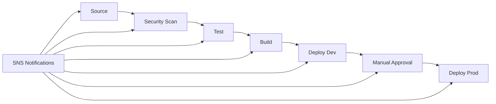

# CI/CD Pipeline Setup Guide

This guide explains how to set up and configure the automated CI/CD pipeline for the AWS Opportunity Analysis application using AWS CodePipeline, CodeBuild, and CodeDeploy.

## Overview

The CI/CD pipeline provides automated testing, building, security scanning, and deployment across multiple environments (dev, staging, prod) with proper approval gates and rollback capabilities.

## Pipeline Architecture



## Pipeline Stages

### 1. Source Stage
- **Trigger**: Automatic on code commits to main branch
- **Source**: AWS CodeCommit repository
- **Output**: Source code artifact

### 2. Security Scan Stage
- **Purpose**: Security vulnerability scanning
- **Tools**: npm audit, Snyk (optional)
- **Failure Action**: Stop pipeline execution

### 3. Test Stage
- **Purpose**: Automated testing with coverage
- **Tests**: Unit tests, integration tests
- **Coverage**: Minimum threshold enforcement
- **Reports**: Jest coverage reports

### 4. Build Stage
- **Purpose**: Application building and CDK synthesis
- **Actions**: 
  - Install dependencies
  - Run CDK synth
  - Create deployment artifacts
- **Output**: Built application and CloudFormation templates

### 5. Deploy Dev Stage
- **Purpose**: Automated deployment to development environment
- **Approval**: Automatic
- **Environment**: Development AWS account/region
- **Rollback**: Automatic on failure

### 6. Manual Approval Stage
- **Purpose**: Human approval gate before production
- **Timeout**: 7 days
- **Notifications**: SNS notifications to approvers
- **Actions**: Approve or reject production deployment

### 7. Deploy Prod Stage
- **Purpose**: Production deployment
- **Approval**: Manual (after approval stage)
- **Environment**: Production AWS account/region
- **Strategy**: Blue-green deployment for Lambda functions
- **Rollback**: Automatic on alarm triggers

## Prerequisites

### AWS Account Setup
1. **AWS CLI configured** with appropriate permissions
2. **CDK bootstrapped** in target regions
3. **CodeCommit repository** created (or GitHub integration configured)
4. **SNS topic** for notifications (optional)

### Required Permissions
The deployment requires the following AWS permissions:
- CodePipeline full access
- CodeBuild full access
- CodeCommit full access (or GitHub integration)
- CodeDeploy full access
- CloudFormation full access
- IAM role creation and management
- S3 bucket creation and management
- SNS topic creation and management

## Deployment Instructions

### Step 1: Deploy CI/CD Infrastructure

```bash
# Deploy the CI/CD pipeline stack
npm run cicd:deploy

# Or manually with CDK
cdk deploy aws-opportunity-analysis-cicd-pipeline
```

### Step 2: Configure Source Repository

#### For CodeCommit:
```bash
# Clone the repository
git clone https://git-codecommit.us-east-1.amazonaws.com/v1/repos/aws-opportunity-analysis

# Add your code and push
git add .
git commit -m "Initial commit"
git push origin main
```

#### For GitHub Integration:
1. Update the pipeline configuration in `lib/cicd-pipeline-stack.js`
2. Replace CodeCommit source with GitHub source action
3. Configure GitHub webhook for automatic triggers

### Step 3: Configure Notifications

```bash
# Subscribe to SNS notifications (replace with your email)
aws sns subscribe \
  --topic-arn arn:aws:sns:us-east-1:ACCOUNT:aws-opportunity-analysis-pipeline-notifications \
  --protocol email \
  --notification-endpoint your-email@company.com
```

### Step 4: Test the Pipeline

1. **Push code changes** to trigger the pipeline
2. **Monitor execution** in AWS CodePipeline console
3. **Review test results** in CodeBuild console
4. **Approve production deployment** when prompted

## Configuration

### Environment Variables

The pipeline uses the following environment variables:

```bash
# Build environment
NODE_ENV=production
AWS_DEFAULT_REGION=us-east-1

# Application configuration
ENVIRONMENT=dev|prod
ENABLE_DEBUG_LOGGING=true|false
```

### Build Specifications

#### Main Build (buildspec.yml)
- Installs dependencies
- Runs security scans
- Executes tests
- Synthesizes CDK templates
- Validates infrastructure

#### Test Build (buildspec-test.yml)
- Focused on testing
- Generates coverage reports
- Runs integration tests
- Produces test artifacts

### Deployment Configuration

#### Development Environment
- **Auto-deployment**: Enabled
- **Rollback**: Automatic on failure
- **Monitoring**: Enhanced logging enabled
- **Notifications**: All events

#### Production Environment
- **Manual approval**: Required
- **Blue-green deployment**: Lambda functions
- **Rollback**: Automatic on CloudWatch alarms
- **Monitoring**: Production-level logging

## Monitoring and Troubleshooting

### Pipeline Monitoring

1. **AWS CodePipeline Console**
   - View pipeline execution history
   - Monitor stage progress
   - Review failure details

2. **AWS CodeBuild Console**
   - View build logs
   - Review test results
   - Monitor build performance

3. **CloudWatch Logs**
   - Detailed execution logs
   - Error tracking
   - Performance metrics

### Common Issues

#### Build Failures
```bash
# Check build logs
aws logs get-log-events \
  --log-group-name /aws/codebuild/aws-opportunity-analysis-build \
  --log-stream-name <stream-name>
```

#### Test Failures
```bash
# Run tests locally
npm test
npm run test:coverage
```

#### Deployment Failures
```bash
# Check CloudFormation events
aws cloudformation describe-stack-events \
  --stack-name aws-opportunity-analysis-dev
```

### Rollback Procedures

#### Automatic Rollback
- Triggered by CloudWatch alarms
- Lambda function errors
- Application health checks

#### Manual Rollback
```bash
# Rollback to previous version
aws codedeploy stop-deployment \
  --deployment-id <deployment-id> \
  --auto-rollback-enabled
```

## Security Considerations

### Code Security
- **Dependency scanning**: npm audit, Snyk
- **Secret management**: AWS Secrets Manager
- **Access control**: IAM roles and policies

### Pipeline Security
- **Artifact encryption**: S3 server-side encryption
- **Access logging**: CloudTrail integration
- **Network security**: VPC endpoints (optional)

### Deployment Security
- **Blue-green deployments**: Zero-downtime updates
- **Rollback capabilities**: Automatic failure recovery
- **Environment isolation**: Separate AWS accounts

## Best Practices

### Code Quality
1. **Automated testing**: Comprehensive test coverage
2. **Code linting**: Consistent code style
3. **Security scanning**: Regular vulnerability checks
4. **Documentation**: Keep docs updated

### Pipeline Management
1. **Branch protection**: Protect main branch
2. **Review process**: Code review requirements
3. **Approval gates**: Manual approval for production
4. **Monitoring**: Comprehensive logging and alerting

### Deployment Strategy
1. **Environment parity**: Keep environments similar
2. **Gradual rollout**: Use canary deployments
3. **Health checks**: Monitor application health
4. **Rollback plan**: Always have a rollback strategy

## Maintenance

### Regular Tasks
1. **Update dependencies**: Keep packages current
2. **Review logs**: Monitor for issues
3. **Update documentation**: Keep guides current
4. **Security patches**: Apply security updates

### Pipeline Updates
1. **Test changes**: Use development environment
2. **Gradual rollout**: Update stages incrementally
3. **Monitor impact**: Watch for performance changes
4. **Document changes**: Update configuration docs

## Support and Resources

### AWS Documentation
- [AWS CodePipeline User Guide](https://docs.aws.amazon.com/codepipeline/)
- [AWS CodeBuild User Guide](https://docs.aws.amazon.com/codebuild/)
- [AWS CodeDeploy User Guide](https://docs.aws.amazon.com/codedeploy/)

### Internal Resources
- Pipeline configuration: `config/cicd-config.js`
- Deployment scripts: `scripts/deploy-cicd.js`
- Build specifications: `buildspec.yml`, `buildspec-test.yml`

### Getting Help
1. **Check logs**: Start with CloudWatch logs
2. **Review documentation**: This guide and AWS docs
3. **Contact team**: Reach out to DevOps team
4. **AWS Support**: For AWS service issues