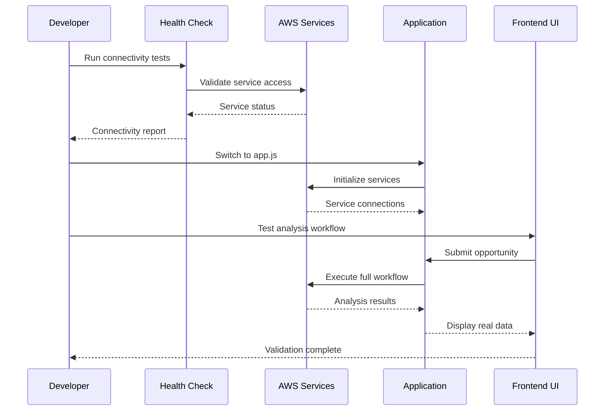

# Design Document

## Overview

The AWS Opportunity Analysis application activation involves systematically enabling the comprehensive serverless architecture that has already been implemented. The application currently operates in debug mode with mock data, but contains a full production-ready implementation with AWS Bedrock, Lambda, Athena, DynamoDB, EventBridge, and advanced caching. The design focuses on validation, activation, and integration testing to ensure all components work together seamlessly.

## Architecture

### Current State Analysis

The application has two operational modes:
- **Debug Mode**: Uses app-debug.js with mock data responses
- **Production Mode**: Uses app.js with full AWS service integrations

The frontend at http://localhost:3123/index-compact.html is already designed to work with both modes through the same API interface.

### High-Level Architecture

```mermaid
graph TB
    subgraph "Frontend Layer"
        UI[Modern Dashboard UI]
        Forms[Opportunity Input Forms]
        Results[Analysis Results Display]
    end
    
    subgraph "Backend API Layer"
        Express[Express Server - app.js]
        API[REST API Endpoints]
        Validation[Input Validation]
        Monitoring[Request Monitoring]
    end
    
    subgraph "AWS Services Layer"
        Bedrock[AWS Bedrock AI]
        BedrockAgent[Bedrock Agent]
        Lambda[Lambda Functions]
        Athena[Amazon Athena]
        DynamoDB[DynamoDB Tables]
        EventBridge[EventBridge Bus]
        S3[S3 Storage]
    end
    
    subgraph "Caching Layer"
        Redis[ElastiCache Redis]
        DynamoCache[DynamoDB Cache]
    end
    
    subgraph "Monitoring Layer"
        CloudWatch[CloudWatch Metrics]
        XRay[X-Ray Tracing]
        Logs[CloudWatch Logs]
    end
    
    UI --> Express
    Forms --> API
    API --> Validation
    API --> Bedrock
    API --> Lambda
    Lambda --> Athena
    Athena --> S3
    API --> DynamoDB
    API --> EventBridge
    API --> Redis
    Express --> CloudWatch
    Results <-- API
```

### Activation Workflow



## Components and Interfaces

### Existing Components (Already Implemented)

#### Backend Services
- **Express Server (app.js)**: Full production server with AWS integrations
- **Automation Modules**: Complete set of v3 AWS SDK automations
- **Monitoring Service**: CloudWatch integration with custom metrics
- **Error Handling Service**: Comprehensive error handling with retry logic
- **Caching Service**: Redis and DynamoDB caching implementation
- **EventBridge Service**: Event-driven architecture for real-time updates
- **DynamoDB Service**: Session management and result caching

#### AWS Integration Modules
- **invokeBedrockQueryPrompt-v3.js**: SQL query generation using Bedrock
- **InvLamFilterAut-v3.js**: Lambda execution for Athena queries
- **finalBedAnalysisPrompt-v3.js**: Standard Bedrock analysis
- **finalBedAnalysisPromptNovaPremier-v3.js**: Premium Nova Premier analysis
- **enhancedFundingAnalysis-v3.js**: Funding options analysis
- **enhancedFollowOnAnalysis-v3.js**: Follow-on opportunity identification

#### Frontend Components (Already Built)
- **Modern Dashboard UI**: Comprehensive interface with real-time updates
- **Form Validation**: Client-side validation with visual feedback
- **Results Display**: Rich formatting for analysis results
- **Progress Tracking**: Real-time completion and analysis status
- **Export Capabilities**: Professional export and print functionality

### Activation Components (To Be Implemented)

#### Health Check System
```typescript
interface HealthCheckResult {
  service: string;
  status: 'healthy' | 'degraded' | 'unhealthy';
  responseTime: number;
  lastChecked: Date;
  details: {
    endpoint?: string;
    error?: string;
    metadata?: any;
  };
}

interface SystemHealth {
  overall: 'healthy' | 'degraded' | 'unhealthy';
  services: HealthCheckResult[];
  timestamp: Date;
  environment: string;
}
```

#### Service Validation Framework
```typescript
interface ServiceValidator {
  validateBedrock(): Promise<ValidationResult>;
  validateLambda(): Promise<ValidationResult>;
  validateAthena(): Promise<ValidationResult>;
  validateDynamoDB(): Promise<ValidationResult>;
  validateEventBridge(): Promise<ValidationResult>;
  validateCaching(): Promise<ValidationResult>;
}

interface ValidationResult {
  success: boolean;
  service: string;
  checks: ValidationCheck[];
  recommendations: string[];
}

interface ValidationCheck {
  name: string;
  passed: boolean;
  message: string;
  details?: any;
}
```

#### Infrastructure Deployment Manager
```typescript
interface DeploymentManager {
  deployLambdaFunction(functionName: string): Promise<DeploymentResult>;
  setupAthenaDatabase(): Promise<DeploymentResult>;
  createDynamoDBTables(): Promise<DeploymentResult>;
  configureEventBridge(): Promise<DeploymentResult>;
  validateDeployment(): Promise<SystemHealth>;
}

interface DeploymentResult {
  success: boolean;
  resourceArn?: string;
  message: string;
  rollbackPlan?: string[];
}
```

## Data Models

### Health Check Models

#### Service Health Status
```typescript
interface ServiceHealth {
  bedrock: {
    queryGeneration: HealthStatus;
    analysis: HealthStatus;
    novaPremier: HealthStatus;
    promptAccess: HealthStatus;
  };
  lambda: {
    catapultGetDataset: HealthStatus;
    invocation: HealthStatus;
    permissions: HealthStatus;
  };
  athena: {
    database: HealthStatus;
    queryExecution: HealthStatus;
    s3Access: HealthStatus;
  };
  dynamodb: {
    analysisResults: HealthStatus;
    userSessions: HealthStatus;
    analysisHistory: HealthStatus;
  };
  eventbridge: {
    customBus: HealthStatus;
    eventPublishing: HealthStatus;
    ruleProcessing: HealthStatus;
  };
  caching: {
    redis: HealthStatus;
    dynamoCache: HealthStatus;
    cacheWarming: HealthStatus;
  };
}

interface HealthStatus {
  status: 'healthy' | 'degraded' | 'unhealthy';
  lastCheck: Date;
  responseTime: number;
  errorCount: number;
  details: string;
}
```

### Deployment Models

#### Infrastructure Configuration
```typescript
interface InfrastructureConfig {
  lambda: {
    functionName: string;
    runtime: string;
    timeout: number;
    memorySize: number;
    environmentVariables: Record<string, string>;
  };
  athena: {
    database: string;
    outputLocation: string;
    workgroup: string;
  };
  dynamodb: {
    tables: DynamoDBTableConfig[];
    globalTables: boolean;
    backupEnabled: boolean;
  };
  eventbridge: {
    busName: string;
    rules: EventBridgeRule[];
  };
  caching: {
    redisCluster: RedisConfig;
    cachingStrategy: CachingStrategy;
  };
}
```

### Validation Models

#### End-to-End Test Scenarios
```typescript
interface TestScenario {
  name: string;
  description: string;
  inputData: OpportunityDetails;
  expectedOutputs: {
    metrics: ExpectedMetrics;
    sections: ExpectedSections;
    performance: PerformanceExpectations;
  };
  validationRules: ValidationRule[];
}

interface ValidationRule {
  field: string;
  type: 'required' | 'format' | 'range' | 'custom';
  condition: any;
  errorMessage: string;
}
```

## Error Handling

### Activation Error Categories

#### Service Connectivity Errors
- AWS credential validation failures
- Service endpoint accessibility issues
- Permission and IAM role problems
- Network connectivity issues

#### Infrastructure Deployment Errors
- Lambda function creation failures
- DynamoDB table creation issues
- EventBridge configuration problems
- S3 bucket access issues

#### Integration Validation Errors
- API endpoint response mismatches
- Data format inconsistencies
- Performance threshold violations
- End-to-end workflow failures

### Error Handling Strategy

#### Progressive Activation Approach
1. **Service Validation**: Test each AWS service independently
2. **Component Integration**: Validate service-to-service communication
3. **Workflow Testing**: Test complete end-to-end scenarios
4. **Performance Validation**: Ensure acceptable response times
5. **Error Scenario Testing**: Validate error handling and recovery

#### Fallback Mechanisms
```typescript
interface FallbackStrategy {
  primary: ServiceEndpoint;
  fallback: ServiceEndpoint;
  condition: FailureCondition;
  recoveryAction: RecoveryAction;
}

interface ServiceEndpoint {
  type: 'aws-service' | 'mock-data' | 'cached-response';
  configuration: any;
  healthCheck: () => Promise<boolean>;
}
```

## Testing Strategy

### Activation Testing Phases

#### Phase 1: Service Connectivity Testing
- AWS credential validation
- Service endpoint accessibility
- Permission verification
- Basic API calls

#### Phase 2: Component Integration Testing
- Service-to-service communication
- Data flow validation
- Error propagation testing
- Performance benchmarking

#### Phase 3: End-to-End Workflow Testing
- Complete analysis workflows
- Frontend-to-backend integration
- Real data processing validation
- User experience testing

#### Phase 4: Production Readiness Testing
- Load testing with realistic data
- Error scenario validation
- Performance optimization
- Security validation

### Test Data Management

#### Test Scenarios
```typescript
interface TestDataSet {
  basicOpportunity: OpportunityDetails;
  complexOpportunity: OpportunityDetails;
  edgeCaseOpportunity: OpportunityDetails;
  invalidOpportunity: OpportunityDetails;
  performanceTestData: OpportunityDetails[];
}
```

#### Validation Criteria
```typescript
interface ValidationCriteria {
  responseTime: {
    queryGeneration: number; // max 5 seconds
    dataRetrieval: number;   // max 10 seconds
    analysis: number;        // max 15 seconds
    totalWorkflow: number;   // max 30 seconds
  };
  dataQuality: {
    requiredFields: string[];
    formatValidation: ValidationRule[];
    businessLogicChecks: ValidationRule[];
  };
  errorHandling: {
    gracefulDegradation: boolean;
    userFriendlyMessages: boolean;
    detailedLogging: boolean;
  };
}
```

## Performance Considerations

### Optimization Strategies

#### Caching Implementation
- **Result Caching**: Cache analysis results in DynamoDB and Redis
- **Query Caching**: Cache frequently used SQL queries
- **Session Caching**: Cache user session data
- **Prompt Caching**: Cache Bedrock prompt responses

#### Connection Management
- **Connection Pooling**: Reuse AWS service connections
- **Lazy Loading**: Initialize services on demand
- **Resource Cleanup**: Proper resource disposal
- **Circuit Breakers**: Prevent cascade failures

#### Performance Monitoring
```typescript
interface PerformanceMetrics {
  responseTime: {
    p50: number;
    p95: number;
    p99: number;
  };
  throughput: {
    requestsPerSecond: number;
    concurrentUsers: number;
  };
  resourceUtilization: {
    cpuUsage: number;
    memoryUsage: number;
    networkIO: number;
  };
  errorRates: {
    clientErrors: number;
    serverErrors: number;
    timeouts: number;
  };
}
```

### Scalability Design

#### Horizontal Scaling
- **Lambda Concurrency**: Configure appropriate concurrency limits
- **DynamoDB Scaling**: Auto-scaling for read/write capacity
- **Redis Clustering**: Multi-node Redis setup for high availability
- **EventBridge Scaling**: Handle high-volume event processing

#### Vertical Scaling
- **Memory Optimization**: Right-size Lambda memory allocation
- **CPU Optimization**: Optimize compute-intensive operations
- **Storage Optimization**: Efficient data storage patterns
- **Network Optimization**: Minimize data transfer

## Security Considerations

### AWS Security Best Practices

#### IAM Configuration
- **Least Privilege**: Minimal required permissions
- **Role-Based Access**: Service-specific IAM roles
- **Credential Management**: Secure credential storage
- **Access Logging**: Comprehensive access audit trails

#### Data Protection
- **Encryption at Rest**: DynamoDB and S3 encryption
- **Encryption in Transit**: TLS for all communications
- **Data Masking**: Sensitive data protection in logs
- **Access Controls**: Fine-grained data access controls

#### Network Security
- **VPC Configuration**: Secure network isolation
- **Security Groups**: Restrictive firewall rules
- **API Gateway**: Rate limiting and throttling
- **WAF Integration**: Web application firewall protection

## Deployment Strategy

### Infrastructure as Code

#### CDK Implementation
```typescript
interface CDKStackConfig {
  lambdaStack: LambdaStackProps;
  dynamodbStack: DynamoDBStackProps;
  eventbridgeStack: EventBridgeStackProps;
  monitoringStack: MonitoringStackProps;
}
```

#### Deployment Pipeline
1. **Infrastructure Validation**: CDK diff and validation
2. **Resource Deployment**: Incremental stack deployment
3. **Service Configuration**: Environment-specific configuration
4. **Health Validation**: Post-deployment health checks
5. **Rollback Planning**: Automated rollback procedures

### Environment Management

#### Multi-Environment Support
- **Development**: Local development with AWS services
- **Staging**: Production-like environment for testing
- **Production**: Full production deployment

#### Configuration Management
```typescript
interface EnvironmentConfig {
  aws: {
    region: string;
    accountId: string;
    profile?: string;
  };
  services: {
    bedrock: BedrockConfig;
    lambda: LambdaConfig;
    athena: AthenaConfig;
    dynamodb: DynamoDBConfig;
    eventbridge: EventBridgeConfig;
  };
  monitoring: {
    cloudwatch: CloudWatchConfig;
    xray: XRayConfig;
    logging: LoggingConfig;
  };
}
```

## Monitoring and Observability

### Comprehensive Monitoring

#### Application Metrics
- **Business Metrics**: Analysis completion rates, user satisfaction
- **Technical Metrics**: Response times, error rates, throughput
- **Infrastructure Metrics**: Resource utilization, cost optimization
- **Security Metrics**: Access patterns, anomaly detection

#### Alerting Strategy
```typescript
interface AlertingConfig {
  errorRateThreshold: number;
  responseTimeThreshold: number;
  availabilityThreshold: number;
  costThreshold: number;
  securityAlerts: SecurityAlertConfig[];
}
```

#### Dashboard Design
- **Executive Dashboard**: High-level business metrics
- **Operational Dashboard**: Technical health and performance
- **Developer Dashboard**: Detailed debugging information
- **Cost Dashboard**: Resource utilization and cost tracking