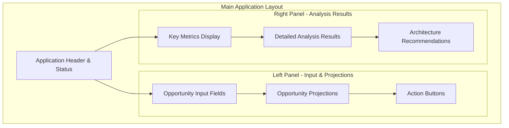
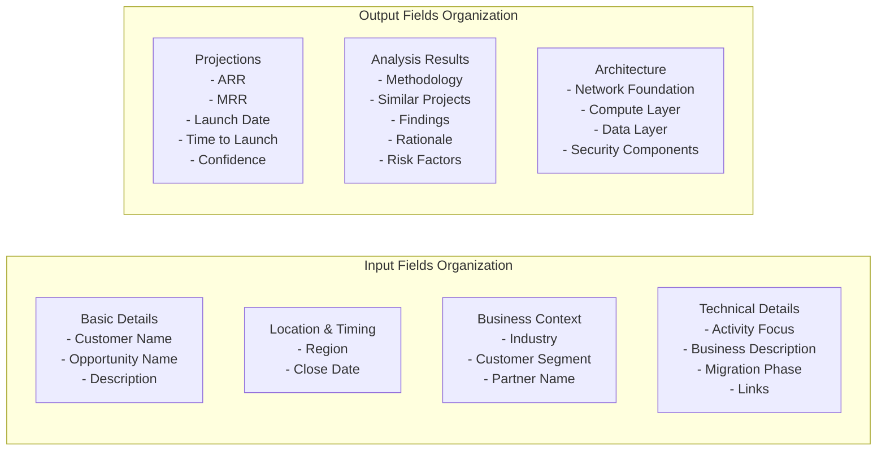

# Design Document

## Overview

The Enhanced UI Fields feature transforms the AWS Opportunity Analysis application from a basic form interface to a comprehensive, always-visible field layout. This design eliminates the need for users to click buttons or navigate between views to access different input and output fields. The interface will display all opportunity input fields, projection metrics, and analysis results simultaneously in an organized, responsive layout that maximizes usability and data visibility.

## Architecture

### High-Level Interface Architecture



### Field Organization Structure



## Components and Interfaces

### Enhanced Input Form Component

#### Field Groups Structure
The input form will be organized into collapsible but always-visible sections:

**Basic Details Section**
- Customer Name (text input, required)
- Opportunity Name (text input, required)
- Opportunity Description (large textarea, required)

**Location & Timing Section**
- Region (dropdown with AWS regions, required)
- Close Date (date picker, required)

**Business Context Section**
- Industry (dropdown with common industries + "Other" option)
- Customer Segment (dropdown: Enterprise, Mid-Market, SMB, Public Sector)
- Partner Name (text input, optional)

**Technical Details Section**
- Activity Focus (dropdown: Migration, Modernization, New Development, Analytics, etc.)
- Business Description (textarea for detailed business context)
- Migration Phase (dropdown: Assessment, Planning, Migration, Optimization)
- Salesforce Link (URL input with validation)
- AWS Calculator Link (URL input with validation)

#### Field Validation and UX
- Real-time validation with visual feedback
- Required field indicators
- Format validation for URLs and dates
- Auto-save functionality for form state
- Clear error messaging

### Enhanced Projections Display Component

#### Always-Visible Metrics
- **ARR (Annual Recurring Revenue)**: Currency formatted with confidence range
- **MRR (Monthly Recurring Revenue)**: Currency formatted with ARR relationship
- **Launch Date**: Date formatted with timeline visualization
- **Time to Launch**: Duration with progress indicator
- **Confidence Level**: Visual indicator (HIGH/MEDIUM/LOW) with color coding
- **Top Services**: Formatted list with estimated costs

#### Visual Enhancements
- Progress bars for confidence levels
- Currency formatting with thousands separators
- Timeline visualization for dates
- Service cost breakdown with visual charts

### Comprehensive Analysis Results Component

#### Structured Result Sections
Each section will be always visible with appropriate formatting:

**Methodology Section**
- Analysis approach description
- Data sources used
- Confidence factors

**Similar Projects Section**
- Sortable table format
- Expandable rows for project details
- Filtering capabilities
- Export functionality

**Detailed Findings Section**
- Structured findings with bullet points
- Key insights highlighted
- Supporting data references

**Prediction Rationale Section**
- Reasoning behind predictions
- Historical data correlations
- Risk assessments

**Risk Factors Section**
- Identified risks with severity levels
- Mitigation strategies
- Impact assessments

**Architecture Recommendations Section**
- Network Foundation components
- Compute Layer recommendations
- Data Layer architecture
- Security Components
- Integration Points
- Scaling Elements
- Management Tools

#### Interactive Features
- Expandable sections for detailed information
- Copy-to-clipboard functionality
- Export to PDF/Word capabilities
- Print-friendly formatting

### Enhanced Action Controls Component

#### Primary Actions
- **Analyze (Standard)**: Standard Bedrock model analysis
- **Analyze (Nova Premier)**: Advanced Nova Premier model analysis
- **Reset Form**: Clear all input fields with confirmation
- **Export Results**: Generate comprehensive report

#### Secondary Actions
- **Funding Analysis**: Analyze funding options
- **Next Opportunity**: Identify follow-on opportunities
- **Save Draft**: Save current form state
- **Load Template**: Load pre-configured templates

#### Progress Indicators
- Step-by-step analysis progress
- Real-time status updates
- Estimated completion times
- Cancel/retry options

## Data Models

### Enhanced Input Data Model

```typescript
interface EnhancedOpportunityInput {
  // Basic Details
  customerName: string;
  opportunityName: string;
  opportunityDescription: string;
  
  // Location & Timing
  region: string;
  closeDate: string;
  
  // Business Context
  industry: string;
  customerSegment: 'Enterprise' | 'Mid-Market' | 'SMB' | 'Public Sector' | 'Other';
  partnerName?: string;
  
  // Technical Details
  activityFocus: 'Migration' | 'Modernization' | 'New Development' | 'Analytics' | 'Other';
  businessDescription?: string;
  migrationPhase?: 'Assessment' | 'Planning' | 'Migration' | 'Optimization';
  salesforceLink?: string;
  awsCalculatorLink?: string;
}
```

### Enhanced Output Data Model

```typescript
interface EnhancedAnalysisOutput {
  // Projections
  projections: {
    arr: {
      value: number;
      formatted: string;
      confidence: number;
      range: { min: number; max: number };
    };
    mrr: {
      value: number;
      formatted: string;
      relationship: string; // e.g., "8.33% of ARR"
    };
    launchDate: {
      date: string;
      daysFromNow: number;
      timeline: string;
    };
    timeToLaunch: {
      months: number;
      formatted: string;
      milestones: string[];
    };
    confidence: {
      level: 'HIGH' | 'MEDIUM' | 'LOW';
      score: number;
      factors: string[];
    };
    topServices: {
      service: string;
      estimatedCost: number;
      description: string;
    }[];
  };
  
  // Analysis Results
  analysis: {
    methodology: {
      approach: string;
      dataSources: string[];
      techniques: string[];
    };
    similarProjects: {
      project: string;
      customer: string;
      industry: string;
      region: string;
      arr: number;
      services: string[];
      similarity: number;
    }[];
    findings: {
      category: string;
      insight: string;
      supporting_data: string;
      confidence: number;
    }[];
    rationale: {
      prediction: string;
      reasoning: string;
      historical_basis: string;
    }[];
    riskFactors: {
      risk: string;
      severity: 'HIGH' | 'MEDIUM' | 'LOW';
      mitigation: string;
      impact: string;
    }[];
  };
  
  // Architecture
  architecture: {
    networkFoundation: string[];
    computeLayer: string[];
    dataLayer: string[];
    securityComponents: string[];
    integrationPoints: string[];
    scalingElements: string[];
    managementTools: string[];
    completeArchitecture: string;
  };
}
```

## Error Handling

### Input Validation Errors
- Real-time field validation with immediate feedback
- Form-level validation before submission
- Clear error messages with correction guidance
- Visual indicators for invalid fields

### Display Errors
- Graceful handling of missing data
- Placeholder content for empty sections
- Loading states for all sections
- Error recovery mechanisms

### Data Processing Errors
- Robust parsing of analysis results
- Fallback displays for malformed data
- Error logging without breaking UI
- User-friendly error messages

## Testing Strategy

### Component Testing
- Individual field validation testing
- Section visibility and interaction testing
- Responsive layout testing
- Data binding and display testing

### Integration Testing
- Form submission and result display testing
- Real-time validation testing
- Export functionality testing
- Cross-browser compatibility testing

### User Experience Testing
- Usability testing with target users
- Accessibility compliance testing
- Performance testing with large datasets
- Mobile responsiveness testing

### Visual Regression Testing
- Layout consistency across screen sizes
- Field alignment and spacing verification
- Color scheme and branding compliance
- Print layout testing

## Performance Considerations

### Frontend Optimization
- Lazy loading of non-critical sections
- Efficient DOM updates for real-time validation
- Optimized CSS for responsive layouts
- Minimal JavaScript for field interactions

### Data Handling Optimization
- Efficient data binding for large result sets
- Pagination for similar projects table
- Caching of form state and results
- Optimized export generation

### Responsive Design Optimization
- Mobile-first CSS approach
- Flexible grid layouts
- Optimized touch interactions
- Efficient media queries

## Accessibility Considerations

### WCAG Compliance
- Proper semantic HTML structure
- ARIA labels for complex interactions
- Keyboard navigation support
- Screen reader compatibility

### Visual Accessibility
- High contrast color schemes
- Scalable font sizes
- Clear visual hierarchy
- Color-blind friendly indicators

### Interaction Accessibility
- Focus management for form fields
- Clear error announcements
- Accessible dropdown and date picker components
- Voice navigation support