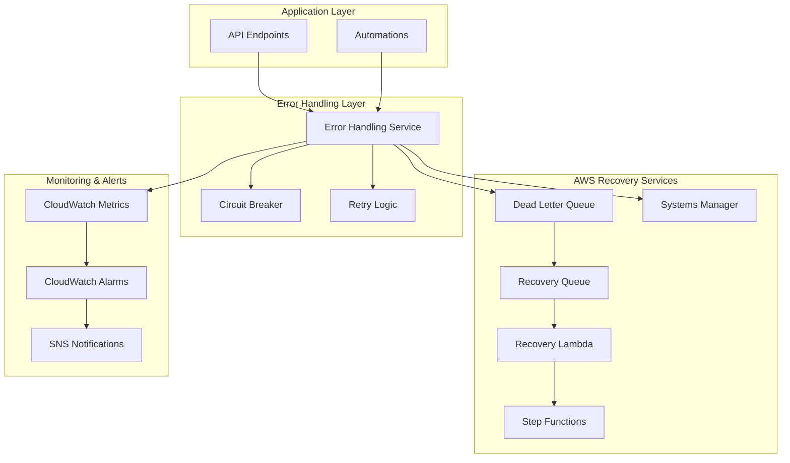

# Advanced Error Handling Guide

## Overview

The AWS Opportunity Analysis application implements comprehensive error handling using AWS services including SQS Dead Letter Queues, Lambda for recovery, Step Functions for orchestration, and Systems Manager for incident response.

## Architecture Overview



## Key Features

### 1. AWS SQS Dead Letter Queues
- **Primary DLQ**: Captures failed operations that exceed retry limits
- **Recovery Queue**: Processes recovery attempts with delayed retries
- **Automatic Processing**: Background processing of failed messages
- **Message Attributes**: Rich metadata for failure analysis

### 2. Exponential Backoff with Jitter
- **Base Delay**: Configurable starting delay (default: 1000ms)
- **Exponential Growth**: Delay doubles with each retry
- **Maximum Delay**: Configurable ceiling (default: 30000ms)
- **Jitter**: ±25% randomization to prevent thundering herd

### 3. Circuit Breaker Pattern
- **Failure Threshold**: Configurable failure count (default: 5)
- **Timeout Period**: Recovery attempt interval (default: 60s)
- **States**: Closed → Open → Half-Open → Closed
- **Per-Operation**: Individual circuit breakers for each operation type

### 4. Automated Error Recovery
- **Recovery Strategies**: Different approaches based on error type
  - `bedrock_fallback`: Switch to simpler Bedrock model
  - `lambda_recovery`: Retry Lambda with simplified payload
  - `network_recovery`: Wait and retry for network issues
  - `credential_refresh`: Refresh AWS credentials
  - `retry_with_backoff`: Standard exponential backoff
- **Recovery Lambda**: Dedicated Lambda function for recovery operations
- **Step Functions**: Orchestrates complex recovery workflows

### 5. Incident Response with AWS Systems Manager
- **SSM Document**: Automated incident response procedures
- **Severity Levels**: LOW, MEDIUM, HIGH, CRITICAL
- **Automated Actions**:
  - Log incident details
  - Send SNS notifications
  - Trigger recovery workflows
  - Escalate based on severity
- **Manual Triggers**: API endpoint for manual incident creation

## Configuration

### Environment Variables
```bash
# Error Handling Infrastructure
ERROR_DLQ_URL=https://sqs.us-east-1.amazonaws.com/account/error-dlq
ERROR_RECOVERY_QUEUE_URL=https://sqs.us-east-1.amazonaws.com/account/error-recovery
ERROR_RECOVERY_LAMBDA=arn:aws:lambda:us-east-1:account:function:error-recovery
ERROR_RECOVERY_STATE_MACHINE=arn:aws:states:us-east-1:account:stateMachine:error-recovery
INCIDENT_RESPONSE_DOCUMENT=OpportunityAnalysis-IncidentResponse
ALERT_TOPIC_ARN=arn:aws:sns:us-east-1:account:error-alerts

# Circuit Breaker Configuration
CIRCUIT_BREAKER_ENABLED=true
CIRCUIT_BREAKER_THRESHOLD=5
CIRCUIT_BREAKER_TIMEOUT=60000
CIRCUIT_BREAKER_WINDOW=300000

# Retry Configuration
MAX_RETRY_ATTEMPTS=5
RETRY_BASE_DELAY=1000
RETRY_MAX_DELAY=30000
RETRY_JITTER_FACTOR=0.25

# Dead Letter Queue Configuration
DLQ_ENABLED=true
DLQ_MAX_BATCH_SIZE=10
DLQ_VISIBILITY_TIMEOUT=300
DLQ_MAX_RECOVERY_ATTEMPTS=3

# Recovery Configuration
RECOVERY_ENABLED=true

# Incident Response Configuration
INCIDENT_RESPONSE_ENABLED=true
INCIDENT_FAILURE_THRESHOLD=10
INCIDENT_TIME_WINDOW=300000
INCIDENT_COOLDOWN=600000

# Monitoring Configuration
ERROR_HANDLING_LOG_LEVEL=INFO
ERROR_HANDLING_INCLUDE_CONTEXT=true
ERROR_HANDLING_INCLUDE_STACK=true
ENHANCED_METRICS_ENABLED=true

# Alert Configuration
ALERT_EMAIL=your-email@example.com
ERROR_RATE_THRESHOLD=0.1
ERROR_RATE_EVAL_PERIODS=2
ERROR_RATE_PERIOD=300
DLQ_ALARM_THRESHOLD=5
```

## Usage Examples

### Basic Error Handling
```javascript
const { ErrorHandlingService } = require('./lib/error-handling-service');
const errorHandler = new ErrorHandlingService();

// Execute operation with comprehensive error handling
const result = await errorHandler.executeWithErrorHandling(
  'bedrock-query-generation',
  async () => {
    return await invokeBedrockQueryPrompt.execute(params);
  },
  {
    maxRetries: 3,
    enableCircuitBreaker: true,
    enableDLQ: true,
    context: {
      customerName: 'Example Corp',
      operationType: 'query-generation'
    }
  }
);
```

### Enhanced Automation Wrapper
```javascript
const { EnhancedErrorHandlingAutomation } = require('./automations/enhanced-error-handling-automation');
const enhancedAutomation = new EnhancedErrorHandlingAutomation();

// Execute complete workflow with error handling
const result = await enhancedAutomation.executeCompleteAnalysisWorkflow({
  CustomerName: 'Example Corp',
  region: 'us-east-1',
  closeDate: '2024-12-31',
  oppName: 'Cloud Migration',
  oppDescription: 'Migrate legacy systems to AWS',
  useNovaPremier: false
});
```

### Manual Recovery Processing
```javascript
// Process Dead Letter Queue messages
const dlqResult = await errorHandler.processDLQMessages(10);
console.log(`Processed: ${dlqResult.processed}, Errors: ${dlqResult.errors}`);

// Reset circuit breaker
errorHandler.resetCircuitBreaker('bedrock-query-generation');

// Trigger incident response
const commandId = await errorHandler.triggerIncidentResponse(
  'critical-operation',
  new Error('System failure'),
  { severity: 'HIGH', manual: true }
);
```

## AWS Infrastructure

### Deployment
```bash
# Deploy error handling infrastructure
npm run error-handling:deploy

# Test error handling components
npm run error-handling:test

# Integrate with existing automations
npm run error-handling:integrate
```

### Infrastructure Components
1. **SQS Queues**:
   - Dead Letter Queue with 14-day retention
   - Recovery Queue with 7-day retention
   - Proper visibility timeouts and batch processing

2. **Lambda Functions**:
   - Error Recovery Lambda with multiple recovery strategies
   - Timeout: 5 minutes
   - Memory: Configurable based on workload

3. **Step Functions**:
   - Recovery workflow orchestration
   - Conditional logic based on error type
   - Parallel processing for independent recovery steps

4. **Systems Manager**:
   - Incident response document
   - Automated notification and escalation
   - Integration with SNS for alerts

5. **CloudWatch**:
   - Custom metrics namespace: `AWS/OpportunityAnalysis/ErrorHandling`
   - Alarms for error rates, circuit breaker status, DLQ messages
   - Dashboards for operational visibility

## Monitoring and Metrics

### CloudWatch Metrics
- `OperationSuccess`: Successful operations count
- `OperationErrors`: Failed operations count
- `OperationDuration`: Operation execution time
- `CircuitBreakerOpened`: Circuit breaker activations
- `DLQMessagesSent`: Messages sent to DLQ
- `DLQMessagesProcessed`: Messages processed from DLQ
- `RecoveryAttempts`: Recovery attempts count
- `SuccessfulRecoveries`: Successful recovery count
- `IncidentResponseTriggered`: Incident responses triggered

### CloudWatch Alarms
- **High Error Rate**: >10% error rate over 5 minutes
- **Circuit Breaker Open**: Any circuit breaker opens
- **DLQ Messages**: >5 messages in DLQ over 5 minutes

## API Endpoints

### Error Handling Management
```bash
# Get error handling statistics
GET /api/error-handling/statistics

# Process Dead Letter Queue messages
POST /api/error-handling/process-dlq
{
  "maxMessages": 10
}

# Reset circuit breaker for specific operation
POST /api/error-handling/reset-circuit-breaker
{
  "operationName": "bedrock-query-generation"
}

# Test error handling with simulated failures
POST /api/error-handling/test
{
  "operationName": "test-operation",
  "shouldFail": true
}

# Get circuit breaker status
GET /api/error-handling/circuit-breakers

# Health check for error handling service
GET /api/error-handling/health

# Trigger incident response manually
POST /api/error-handling/trigger-incident
{
  "operationName": "critical-operation",
  "errorMessage": "System failure detected",
  "severity": "HIGH"
}

# Enhanced analysis with error handling
POST /api/analyze/enhanced-error-handling
{
  "CustomerName": "Example Corp",
  "region": "us-east-1",
  "closeDate": "2024-12-31",
  "oppName": "Cloud Migration",
  "oppDescription": "Migrate legacy systems to AWS",
  "useNovaPremier": false
}
```

## Best Practices

### 1. Error Classification
- **Retryable Errors**: Timeouts, throttling, temporary failures
- **Non-Retryable Errors**: Authentication, authorization, validation errors
- **Circuit Breaker Errors**: Persistent service failures

### 2. Recovery Strategies
- **Bedrock Fallback**: Use simpler models for analysis
- **Lambda Recovery**: Retry with reduced payload or timeout
- **Network Recovery**: Wait and retry for connectivity issues
- **Credential Refresh**: Refresh AWS credentials and retry

### 3. Monitoring and Alerting
- Monitor error rates and trends
- Set up alerts for circuit breaker activations
- Track recovery success rates
- Monitor DLQ message accumulation

### 4. Incident Response
- Define severity levels and escalation procedures
- Automate common recovery actions
- Maintain runbooks for manual intervention
- Regular testing of incident response procedures

## Troubleshooting

### Common Issues
1. **High Error Rates**: Check AWS service limits and quotas
2. **Circuit Breaker Stuck Open**: Verify underlying service health
3. **DLQ Message Accumulation**: Review error patterns and recovery logic
4. **Recovery Failures**: Check Lambda function logs and permissions

### Debugging Commands
```bash
# Check error handling health
curl http://localhost:8123/api/error-handling/health

# Get detailed statistics
curl http://localhost:8123/api/error-handling/statistics

# View circuit breaker status
curl http://localhost:8123/api/error-handling/circuit-breakers

# Test error handling
curl -X POST http://localhost:8123/api/error-handling/test \
  -H "Content-Type: application/json" \
  -d '{"operationName": "test", "shouldFail": true}'
```

## Integration Testing

Run comprehensive error handling tests:
```bash
# Run all error handling tests
npm run error-handling:test

# Integrate error handling with existing automations
npm run error-handling:integrate

# Deploy error handling infrastructure
npm run error-handling:deploy
```

The error handling system provides robust failure management, automated recovery, and comprehensive monitoring to ensure high availability and reliability of the AWS Opportunity Analysis application.