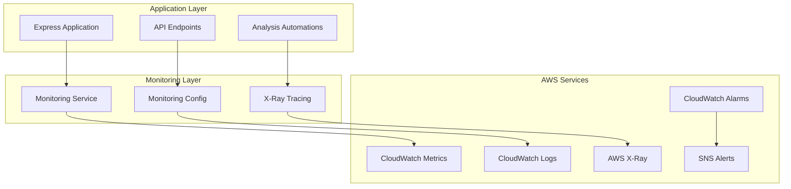

# AWS Opportunity Analysis - Comprehensive Monitoring Guide

## Overview

This guide covers the comprehensive monitoring implementation for the AWS Opportunity Analysis application, including CloudWatch metrics, X-Ray tracing, structured logging, and automated alerting.

## Architecture

### Monitoring Components



## Features Implemented

### ✅ CloudWatch Custom Metrics for Business KPIs

**Metrics Tracked:**
- `AnalysisRequests` - Total number of analysis requests
- `AnalysisLatency` - Time taken for analysis completion
- `AnalysisErrors` - Number of failed analyses
- `BedrockInvocations` - Bedrock API calls with model breakdown
- `QueryExecutions` - SQL query executions via Lambda
- `CacheHitRate` - Analysis result cache effectiveness

**Dimensions:**
- Service: `opportunity-analysis`
- Region: AWS region of the request
- Status: `Success` or `Error`
- ModelId: Bedrock model used (`amazon.titan-text-express-v1`, `amazon.nova-premier-v1:0`)
- AnalysisType: `standard` or `nova-premier`

### ✅ CloudWatch Alarms for Error Rates, Latency, and Costs

**Configured Alarms:**

1. **High Error Rate Alarm**
   - Metric: `AnalysisErrors`
   - Threshold: 10 errors in 5 minutes
   - Evaluation Periods: 2
   - Action: SNS notification

2. **High Latency Alarm**
   - Metric: `AnalysisLatency`
   - Threshold: 30 seconds average
   - Evaluation Periods: 3
   - Action: SNS notification

3. **Bedrock Throttling Alarm**
   - Metric: `BedrockInvocations` (Error status)
   - Threshold: 5 errors in 5 minutes
   - Evaluation Periods: 2
   - Action: SNS notification

### ✅ X-Ray Tracing Across All Lambda Functions and API Calls

**Tracing Implementation:**
- Automatic trace initialization for each request
- Subsegment creation for major operations:
  - Query generation (Bedrock)
  - Data retrieval (Lambda/Athena)
  - Analysis processing (Bedrock)
- Error tracking with detailed exception information
- Performance metrics for each subsegment

**Sampling Rules:**
- API Gateway: 10% fixed rate, 1 reservoir
- Lambda Functions: 20% fixed rate, 2 reservoir
- Step Functions: 30% fixed rate, 1 reservoir
- Bedrock Operations: 10% fixed rate, 1 reservoir

### ✅ CloudWatch Insights for Log Analysis and Troubleshooting

**Pre-configured Queries:**

1. **Error Analysis**
   ```sql
   fields @timestamp, @message, @logStream
   | filter @message like /ERROR/
   | stats count() by bin(5m)
   | sort @timestamp desc
   ```

2. **Performance Analysis**
   ```sql
   fields @timestamp, @message, @duration
   | filter @message like /Analysis completed/
   | stats avg(@duration), max(@duration), min(@duration) by bin(5m)
   | sort @timestamp desc
   ```

3. **Bedrock Usage Analysis**
   ```sql
   fields @timestamp, @message
   | filter @message like /Bedrock/
   | stats count() by bin(5m)
   | sort @timestamp desc
   ```

4. **User Activity Analysis**
   ```sql
   fields @timestamp, @message
   | filter @message like /Customer/
   | parse @message "Customer: *" as customer
   | stats count() by customer
   | sort count desc
   ```

### ✅ CloudWatch Dashboards for Operational Visibility

**Dashboard Widgets:**

1. **Business KPIs Row**
   - Total Analysis Requests (24h)
   - Average Analysis Latency
   - Error Rate Percentage
   - Cache Hit Rate Percentage

2. **Request and Error Trends Row**
   - Analysis Requests Over Time
   - Error Trends Over Time

3. **Performance Metrics Row**
   - Analysis Latency Distribution (Average, P95, P99)
   - Service Invocations (Bedrock, Lambda)

4. **AWS Service Metrics Row**
   - Bedrock Model Invocations by Model
   - Bedrock Latency by Model

5. **Infrastructure Metrics Row**
   - DynamoDB Read/Write Capacity
   - S3 Object Count and Storage

6. **Log Analysis Row**
   - Recent Errors from CloudWatch Logs

### ✅ Automated Alerting with SNS and Lambda

**Alert Processing:**
- SNS topic: `opportunity-analysis-alerts`
- Lambda function for enhanced alert processing
- Email notifications (configurable via `ALERT_EMAIL` environment variable)
- Automated incident tracking with custom metrics

**Alert Enhancement Features:**
- Critical alert detection with enhanced messaging
- Recommended actions included in notifications
- Dashboard links for quick troubleshooting
- Incident metrics for tracking alert frequency

## Deployment

### Prerequisites

1. AWS CLI configured with appropriate permissions
2. Node.js 18+ installed
3. Environment variables configured:
   ```bash
   AWS_REGION=us-east-1
   ALERT_EMAIL=your-email@example.com  # Optional
   ```

### Deploy Monitoring Infrastructure

```bash
# Deploy monitoring stack
node scripts/deploy-monitoring.js

# Validate deployment
node scripts/test-monitoring.js
```

### Manual Configuration Steps

1. **Configure X-Ray Sampling Rules** (via AWS Console):
   - Navigate to X-Ray → Sampling rules
   - Create rules as specified in the architecture section

2. **Set up Email Alerts**:
   - Set `ALERT_EMAIL` environment variable
   - Confirm email subscription in SNS

3. **Customize Dashboard**:
   - Access CloudWatch → Dashboards
   - Modify "AWS-Opportunity-Analysis-Comprehensive" as needed

## Usage

### Monitoring API Endpoints

#### Get Comprehensive Metrics
```bash
GET /api/monitoring/metrics?timeRange=3600
```

Response:
```json
{
  "success": true,
  "timeRange": 3600,
  "metrics": {
    "totalRequests": 150,
    "totalErrors": 2,
    "errorRate": 1.33,
    "averageLatency": 2500,
    "maxLatency": 8000,
    "bedrockInvocations": 300
  },
  "timestamp": "2024-01-15T10:30:00.000Z"
}
```

#### Get Alarm Status
```bash
GET /api/monitoring/alarms
```

#### Run CloudWatch Insights Query
```bash
POST /api/monitoring/insights
Content-Type: application/json

{
  "queryType": "errorAnalysis",
  "timeRange": 3600
}
```

#### Health Check with Monitoring
```bash
GET /api/monitoring/health
```

#### Test Monitoring Components
```bash
POST /api/monitoring/test
Content-Type: application/json

{
  "testType": "trace"  // or "metric" or "error"
}
```

### Programmatic Usage

#### Initialize Request Monitoring
```javascript
const { MonitoringService } = require('./lib/monitoring-service');
const monitoringService = new MonitoringService();

// Initialize monitoring for a request
const traceId = await monitoringService.initializeRequestMonitoring(
  'request-123',
  { customerName: 'Test Corp', region: 'us-east-1' }
);
```

#### Monitor Operations
```javascript
// Monitor Bedrock operations
const result = await monitoringService.monitorBedrockOperation(
  'query-generation',
  'amazon.titan-text-express-v1',
  async () => {
    // Your Bedrock operation here
    return await bedrockOperation();
  }
);

// Monitor Lambda operations
const lambdaResult = await monitoringService.monitorLambdaOperation(
  'catapult_get_dataset',
  async () => {
    // Your Lambda invocation here
    return await lambdaInvocation();
  }
);
```

#### Record Custom Metrics
```javascript
const { monitoringConfig } = require('./config/monitoring-config');

// Record business metrics
await monitoringConfig.recordAnalysisRequest('Customer', 'us-east-1', true, 2500);
await monitoringConfig.recordBedrockInvocation('amazon.titan-text-express-v1', true, 1200);
await monitoringConfig.recordError('validation-error', 'Invalid input data');
```

#### Structured Logging
```javascript
// Log with structured format
await monitoringConfig.logInfo('Analysis completed', {
  customerName: 'Test Corp',
  duration: 2500,
  confidence: 'HIGH'
});

await monitoringConfig.logError('Analysis failed', error, {
  customerName: 'Test Corp',
  step: 'bedrock-analysis'
});
```

## Troubleshooting

### Common Issues

1. **Missing Metrics in CloudWatch**
   - Check AWS credentials and permissions
   - Verify region configuration
   - Ensure CloudWatch PutMetricData permissions

2. **X-Ray Traces Not Appearing**
   - Verify X-Ray service is enabled
   - Check sampling rules configuration
   - Ensure X-Ray daemon permissions

3. **Alarms Not Triggering**
   - Check alarm thresholds and evaluation periods
   - Verify SNS topic permissions
   - Confirm email subscription

4. **Log Groups Not Created**
   - Check CloudWatch Logs permissions
   - Verify log group names match configuration
   - Ensure retention policies are set

### Debug Commands

```bash
# Test monitoring functionality
node scripts/test-monitoring.js

# Check CloudWatch metrics
aws cloudwatch get-metric-statistics \
  --namespace AWS/OpportunityAnalysis \
  --metric-name AnalysisRequests \
  --start-time 2024-01-15T00:00:00Z \
  --end-time 2024-01-15T23:59:59Z \
  --period 3600 \
  --statistics Sum

# Check X-Ray traces
aws xray get-trace-summaries \
  --time-range-type TimeRangeByStartTime \
  --start-time 2024-01-15T00:00:00Z \
  --end-time 2024-01-15T23:59:59Z

# Check alarm status
aws cloudwatch describe-alarms \
  --alarm-name-prefix OpportunityAnalysis-
```

## Performance Considerations

### Monitoring Overhead
- X-Ray tracing adds ~1-2ms per request
- CloudWatch metrics are batched for efficiency
- Structured logging is asynchronous where possible

### Cost Optimization
- Sampling rules configured to balance visibility and cost
- Log retention set to 30 days
- Metrics aggregated at 5-minute intervals

### Scaling Considerations
- Monitoring scales automatically with application load
- CloudWatch Insights queries have built-in limits
- X-Ray trace storage has automatic cleanup

## Security

### IAM Permissions Required

```json
{
  "Version": "2012-10-17",
  "Statement": [
    {
      "Effect": "Allow",
      "Action": [
        "cloudwatch:PutMetricData",
        "cloudwatch:GetMetricStatistics",
        "cloudwatch:DescribeAlarms"
      ],
      "Resource": "*"
    },
    {
      "Effect": "Allow",
      "Action": [
        "logs:CreateLogGroup",
        "logs:CreateLogStream",
        "logs:PutLogEvents",
        "logs:StartQuery",
        "logs:GetQueryResults"
      ],
      "Resource": "arn:aws:logs:*:*:log-group:/aws/opportunity-analysis/*"
    },
    {
      "Effect": "Allow",
      "Action": [
        "xray:PutTraceSegments",
        "xray:PutTelemetryRecords"
      ],
      "Resource": "*"
    },
    {
      "Effect": "Allow",
      "Action": [
        "sns:Publish"
      ],
      "Resource": "arn:aws:sns:*:*:opportunity-analysis-alerts"
    }
  ]
}
```

### Data Privacy
- No sensitive customer data is logged in traces
- PII is masked in structured logs
- Metrics contain only aggregated data

## Maintenance

### Regular Tasks

1. **Weekly**
   - Review dashboard for trends
   - Check alarm history
   - Validate monitoring coverage

2. **Monthly**
   - Review and adjust alarm thresholds
   - Analyze cost trends
   - Update sampling rules if needed

3. **Quarterly**
   - Review log retention policies
   - Update monitoring documentation
   - Assess new monitoring requirements

### Monitoring the Monitoring

- Health checks for monitoring components
- Alerts for monitoring service failures
- Automated validation of monitoring functionality

## Integration with CI/CD

### Automated Testing
```bash
# Include in CI pipeline
npm run test:monitoring

# Validate monitoring deployment
npm run validate:monitoring
```

### Deployment Validation
- Automated health checks post-deployment
- Monitoring metric validation
- Alert configuration verification

## Future Enhancements

### Planned Features
- [ ] Machine learning-based anomaly detection
- [ ] Custom business intelligence dashboards
- [ ] Integration with AWS Cost Explorer
- [ ] Automated performance optimization recommendations
- [ ] Multi-region monitoring aggregation

### Advanced Analytics
- [ ] Predictive alerting based on trends
- [ ] Customer usage pattern analysis
- [ ] Performance regression detection
- [ ] Capacity planning recommendations

## Support

For monitoring-related issues:
1. Check this documentation
2. Run diagnostic scripts
3. Review CloudWatch logs and X-Ray traces
4. Contact the development team with trace IDs and timestamps

## Conclusion

The comprehensive monitoring implementation provides full visibility into the AWS Opportunity Analysis application's performance, errors, and business metrics. The combination of CloudWatch metrics, X-Ray tracing, structured logging, and automated alerting ensures proactive monitoring and rapid issue resolution.