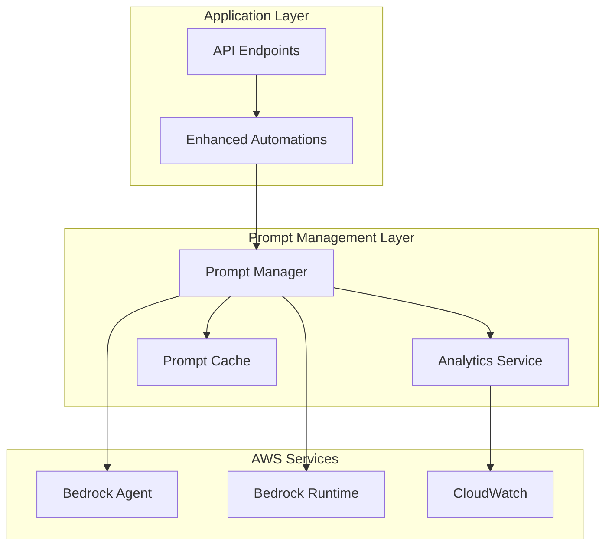

# Enhanced Bedrock Prompt Management Guide

This guide covers the advanced Bedrock Prompt Management system that provides intelligent prompt selection, A/B testing, performance monitoring, and analytics for the AWS Opportunity Analysis application.

## Overview

The Enhanced Prompt Management system includes:

- **Dynamic Prompt Selection**: Automatically selects optimal prompts based on opportunity characteristics
- **A/B Testing**: Compares prompt variants to optimize performance
- **Performance Monitoring**: Tracks response times, quality scores, and success rates
- **Analytics Dashboard**: Provides insights into prompt performance and usage patterns
- **RAG Enhancement**: Enriches prompts with industry and regional context

## Architecture



## Components

### 1. BedrockPromptManager

The core prompt management service that handles:

- Prompt selection based on opportunity characteristics
- A/B test configuration and variant selection
- Performance metrics recording
- Caching for improved performance

**Key Methods:**
- `getOptimalPrompt(promptType, characteristics)` - Select best prompt
- `recordPromptPerformance(promptType, promptId, metrics)` - Record metrics
- `updateABTestConfig(promptType, config)` - Configure A/B tests

### 2. Enhanced Automations

Enhanced versions of the original automations with advanced prompt management:

- `enhancedBedrockQueryPrompt-v3.js` - SQL query generation with optimization
- `enhancedAnalysisWithRAG-v3.js` - Analysis with RAG enhancement
- `enhancedFundingAnalysis-v3.js` - Funding analysis with industry context
- `enhancedFollowOnAnalysis-v3.js` - Follow-on opportunity identification

### 3. PromptAnalyticsService

Provides comprehensive analytics and monitoring:

- Performance metrics aggregation
- A/B test result analysis
- CloudWatch integration
- Optimization recommendations

### 4. API Endpoints

New endpoints for enhanced functionality:

- `POST /api/analyze/enhanced` - Enhanced opportunity analysis
- `POST /api/analyze/funding/enhanced` - Enhanced funding analysis
- `POST /api/analyze/next-opportunity/enhanced` - Enhanced follow-on analysis
- `GET /api/prompt-analytics` - Performance analytics
- `POST /api/prompt-management/ab-test-config` - A/B test configuration

## Configuration

### Environment Variables

Add these to your `.env` file:

```bash
# Enhanced Prompt Management - A/B Testing Prompt IDs
CATAPULT_QUERY_PROMPT_ID_V2=your-optimized-query-prompt-id
CATAPULT_FUNDING_PROMPT_ID=your-funding-analysis-prompt-id
CATAPULT_FUNDING_PROMPT_ENHANCED_ID=your-enhanced-funding-prompt-id
CATAPULT_FOLLOWON_PROMPT_ID=your-followon-analysis-prompt-id

# Prompt Management Configuration
ENABLE_AB_TESTING=true
ENABLE_PROMPT_ANALYTICS=true
PROMPT_CACHE_TIMEOUT=300000
ANALYTICS_CACHE_TIMEOUT=300000
```

### A/B Test Configuration

Configure A/B tests via API:

```javascript
POST /api/prompt-management/ab-test-config
{
  "promptType": "query-generation",
  "config": {
    "enabled": true,
    "variants": [
      { "promptId": "PROMPT_ID_1", "weight": 70, "version": "standard" },
      { "promptId": "PROMPT_ID_2", "weight": 30, "version": "optimized" }
    ],
    "metrics": ["response_time", "query_quality", "success_rate"]
  }
}
```

## Deployment

### 1. Deploy Prompt Templates

```bash
npm run prompt-management:deploy
```

This will:
- Create enhanced prompt templates
- Set up prompt versions for A/B testing
- Deploy CloudWatch monitoring dashboard
- Provide configuration instructions

### 2. Update Environment Variables

Add the generated prompt IDs to your `.env` file as instructed by the deployment script.

### 3. Test the System

```bash
# Run comprehensive tests
npm run prompt-management:test

# Run performance benchmarks
npm run prompt-management:benchmark

# List existing prompts
npm run prompt-management:list
```

## Usage

### Basic Enhanced Analysis

```javascript
// Use enhanced analysis with automatic prompt optimization
const response = await fetch('/api/analyze/enhanced', {
  method: 'POST',
  headers: { 'Content-Type': 'application/json' },
  body: JSON.stringify({
    CustomerName: 'Enterprise Corp',
    region: 'us-east-1',
    closeDate: '2025-06-15',
    oppName: 'Cloud Migration',
    oppDescription: 'Large enterprise migration project...',
    useEnhancedPrompts: true
  })
});

const result = await response.json();
console.log('Analysis:', result);
console.log('Prompt Metadata:', result.queryMetadata);
```

### Enhanced Funding Analysis

```javascript
const fundingResponse = await fetch('/api/analyze/funding/enhanced', {
  method: 'POST',
  headers: { 'Content-Type': 'application/json' },
  body: JSON.stringify({
    customerName: 'Enterprise Corp',
    region: 'us-east-1',
    oppName: 'Cloud Migration',
    oppDescription: 'Large enterprise migration...',
    projectedArr: '$2,500,000',
    topServices: 'EC2, RDS, S3, Lambda'
  })
});
```

### Get Analytics

```javascript
// Get comprehensive analytics
const analytics = await fetch('/api/prompt-analytics?timeRange=86400000'); // 24 hours

// Get specific prompt type analytics
const queryAnalytics = await fetch('/api/prompt-analytics/query-generation');
```

## Dynamic Prompt Selection

The system automatically selects optimal prompts based on opportunity characteristics:

### Selection Criteria

1. **Opportunity Size**
   - Enterprise: High-performance prompts with advanced features
   - SMB: Efficient prompts optimized for speed
   - Medium: Balanced approach

2. **Complexity Level**
   - High: Detailed prompts with comprehensive analysis
   - Medium: Standard prompts with good coverage
   - Low: Streamlined prompts for simple scenarios

3. **Industry Vertical**
   - Financial: Compliance-focused prompts
   - Healthcare: HIPAA-aware prompts
   - Government: Security-enhanced prompts
   - General: Standard prompts

4. **Customer Segment**
   - Enterprise: Feature-rich prompts
   - Commercial: Balanced prompts
   - Startup: Growth-oriented prompts

### Business Rules

The system applies business rules before falling back to A/B testing:

```javascript
// Example: Enterprise opportunities use Nova Premier
if (characteristics.opportunitySize === 'enterprise' || 
    characteristics.predictedArr > 1000000) {
  return 'nova-premier-prompt';
}

// SMB opportunities use standard prompts
if (characteristics.opportunitySize === 'smb') {
  return 'standard-prompt';
}
```

## A/B Testing

### Configuration

A/B tests are configured per prompt type with:

- **Variants**: Different prompt versions to test
- **Weights**: Traffic distribution percentages
- **Metrics**: Performance indicators to track

### Evaluation

The system automatically evaluates A/B test results based on:

- **Quality Scores**: Accuracy and completeness of responses
- **Response Times**: Performance metrics
- **Success Rates**: Error rates and completion rates
- **User Feedback**: Implicit feedback from usage patterns

### Winner Selection

Winners are determined using a composite score:

```javascript
score = (qualityScore * 0.4) + 
        (successRate * 0.3) + 
        (responseTimeScore * 0.2) + 
        (volumeScore * 0.1)
```

## Performance Monitoring

### Metrics Tracked

1. **Response Time**: Time to generate responses
2. **Quality Scores**: Content quality and accuracy
3. **Success Rates**: Completion without errors
4. **Usage Volume**: Number of requests per prompt
5. **Confidence Scores**: Model confidence in responses

### CloudWatch Integration

Metrics are automatically sent to CloudWatch under the `AWS/BedrockPrompts` namespace:

- `selection_count`: Number of times a prompt was selected
- `response_time`: Response time in milliseconds
- `success_rate`: Success rate as a percentage
- `query_quality`: Quality score for query generation
- `analysis_quality`: Quality score for analysis
- `funding_accuracy`: Accuracy score for funding analysis
- `opportunity_relevance`: Relevance score for follow-on analysis

### Dashboard

A CloudWatch dashboard is automatically created showing:

- Prompt usage by type
- Average response times
- Success rates
- Quality metrics over time

## RAG Enhancement

The enhanced system includes Retrieval Augmented Generation (RAG) capabilities:

### Industry Context

Prompts are enhanced with industry-specific information:

```javascript
const industryContext = {
  'financial': {
    keyServices: ['AWS PrivateLink', 'AWS CloudHSM', 'Amazon GuardDuty'],
    complianceRequirements: ['PCI DSS', 'SOX', 'GDPR'],
    typicalTimelines: '12-18 months'
  }
  // ... other industries
};
```

### Regional Context

Regional considerations are automatically included:

```javascript
const regionalContext = {
  'us-east-1': {
    advantages: ['Lowest latency for US East Coast', 'Most services available'],
    considerations: ['High demand region']
  }
  // ... other regions
};
```

### Complexity Context

Complexity-specific guidance is added:

```javascript
const complexityContext = {
  'high': {
    recommendedApproach: 'Phased migration with extensive testing',
    timelineMultiplier: 1.5,
    additionalServices: ['AWS Migration Hub', 'AWS Application Discovery Service']
  }
  // ... other complexity levels
};
```

## Troubleshooting

### Common Issues

1. **Prompt Not Found**
   - Verify prompt IDs in environment variables
   - Check AWS region configuration
   - Ensure prompts are deployed

2. **A/B Test Not Working**
   - Verify A/B test configuration
   - Check traffic volume (minimum 10 requests)
   - Review variant weights

3. **Analytics Not Available**
   - Check CloudWatch permissions
   - Verify metrics are being sent
   - Allow time for data aggregation

4. **Performance Issues**
   - Check cache configuration
   - Monitor CloudWatch metrics
   - Review prompt complexity

### Debug Mode

Enable debug logging:

```bash
DEBUG=true npm start
```

### Cache Issues

Clear caches if needed:

```bash
curl -X POST http://localhost:8123/api/prompt-management/clear-cache
```

## Best Practices

### Prompt Design

1. **Clear Instructions**: Use specific, actionable instructions
2. **Context Awareness**: Include relevant context variables
3. **Output Format**: Specify exact output format requirements
4. **Error Handling**: Include fallback instructions

### A/B Testing

1. **Statistical Significance**: Ensure sufficient sample size
2. **Single Variable**: Test one change at a time
3. **Duration**: Run tests for adequate time periods
4. **Documentation**: Document test hypotheses and results

### Performance Optimization

1. **Caching**: Use appropriate cache timeouts
2. **Monitoring**: Set up alerts for performance degradation
3. **Optimization**: Regularly review and optimize prompts
4. **Scaling**: Monitor usage patterns and scale accordingly

### Security

1. **Access Control**: Restrict access to prompt management APIs
2. **Data Privacy**: Ensure sensitive data is not logged
3. **Audit Trail**: Maintain logs of configuration changes
4. **Compliance**: Follow organizational security policies

## API Reference

### Enhanced Analysis Endpoints

#### POST /api/analyze/enhanced
Enhanced opportunity analysis with prompt management.

**Request:**
```json
{
  "CustomerName": "string",
  "region": "string",
  "closeDate": "string",
  "oppName": "string",
  "oppDescription": "string",
  "useEnhancedPrompts": true
}
```

**Response:**
```json
{
  "status": "success",
  "metrics": { ... },
  "sections": { ... },
  "enhancedAnalysis": true,
  "queryMetadata": {
    "promptId": "string",
    "selectionReason": "string",
    "responseTime": 1500
  },
  "analysisMetadata": { ... }
}
```

#### POST /api/analyze/funding/enhanced
Enhanced funding analysis.

#### POST /api/analyze/next-opportunity/enhanced
Enhanced follow-on opportunity analysis.

### Analytics Endpoints

#### GET /api/prompt-analytics
Get comprehensive analytics for all prompt types.

**Query Parameters:**
- `timeRange`: Time range in milliseconds (default: 24 hours)

#### GET /api/prompt-analytics/:promptType
Get analytics for a specific prompt type.

### Management Endpoints

#### POST /api/prompt-management/ab-test-config
Configure A/B testing for a prompt type.

#### POST /api/prompt-management/clear-cache
Clear prompt and analytics caches.

#### GET /api/prompt-management/performance-summary
Get performance summary for dashboard display.

## Migration Guide

### From Standard to Enhanced

1. **Deploy Enhanced System**
   ```bash
   npm run prompt-management:deploy
   ```

2. **Update Environment Variables**
   Add new prompt IDs to `.env` file

3. **Test Enhanced Endpoints**
   ```bash
   npm run prompt-management:test
   ```

4. **Gradual Migration**
   - Start with enhanced endpoints for new requests
   - Monitor performance and quality
   - Gradually migrate existing functionality

5. **Monitor and Optimize**
   - Use analytics dashboard
   - Adjust A/B test configurations
   - Optimize based on performance data

### Rollback Plan

If issues occur:

1. **Disable Enhanced Features**
   ```bash
   ENABLE_AB_TESTING=false
   ENABLE_PROMPT_ANALYTICS=false
   ```

2. **Use Standard Endpoints**
   Route traffic back to `/api/analyze` instead of `/api/analyze/enhanced`

3. **Clear Caches**
   ```bash
   curl -X POST http://localhost:8123/api/prompt-management/clear-cache
   ```

## Support

For issues or questions:

1. Check the troubleshooting section
2. Review CloudWatch logs and metrics
3. Run diagnostic tests: `npm run prompt-management:test`
4. Check the GitHub repository for updates

## Changelog

### Version 1.0.0
- Initial release of Enhanced Prompt Management
- Dynamic prompt selection
- A/B testing framework
- Performance monitoring
- RAG enhancement
- Analytics dashboard