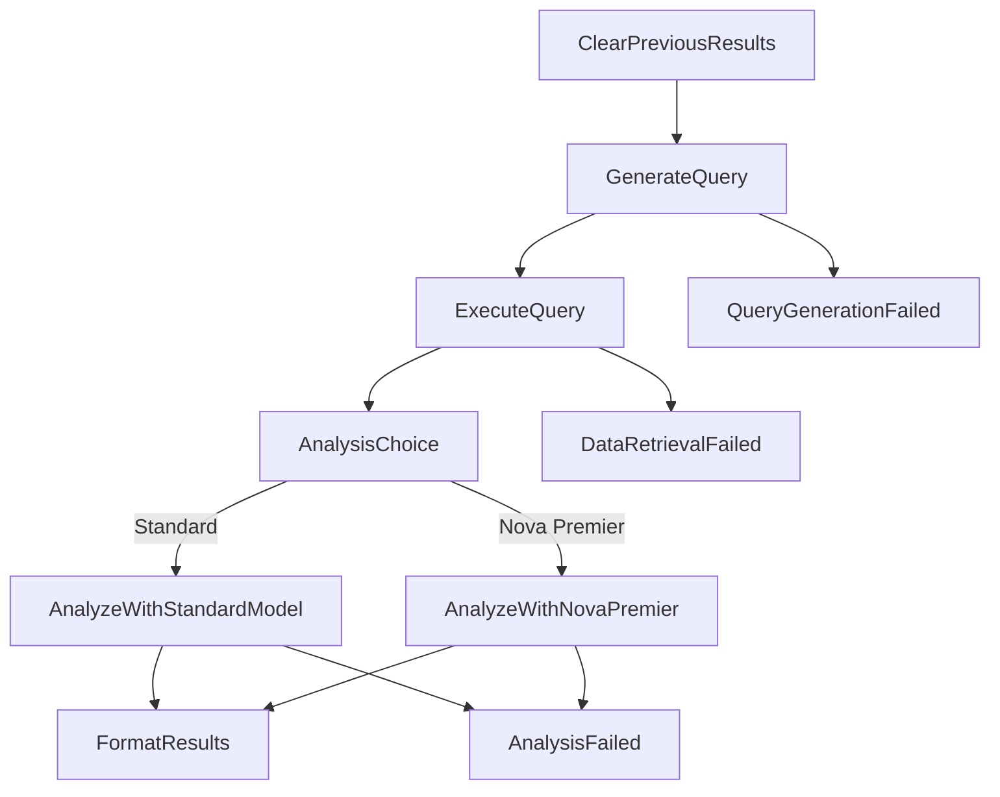

# Step Functions Implementation Guide

## Overview

This guide covers the implementation of AWS Step Functions for orchestrating the opportunity analysis workflows. The Step Functions provide robust workflow orchestration with error handling, retry logic, and parallel execution capabilities.

## Architecture

### State Machines

1. **Opportunity Analysis Workflow** (`OpportunityAnalysisWorkflow`)
   - Main workflow for analyzing business opportunities
   - Supports both standard and Nova Premier Bedrock models
   - Includes field clearing, query generation, data retrieval, and analysis

2. **Funding Analysis Workflow** (`FundingAnalysisWorkflow`)
   - Analyzes funding options for opportunities
   - Runs independently or as part of the main workflow

3. **Follow-On Analysis Workflow** (`FollowOnAnalysisWorkflow`)
   - Identifies follow-on opportunities
   - Generates additional queries and analysis

### Lambda Functions

Each workflow uses dedicated Lambda functions:

- `query-generation.handler` - Generates SQL queries using Bedrock
- `data-retrieval.handler` - Executes queries against Athena
- `opportunity-analysis.handler` - Performs opportunity analysis
- `funding-analysis.handler` - Analyzes funding options
- `follow-on-analysis.handler` - Identifies follow-on opportunities

## Workflow Details

### Opportunity Analysis Workflow



### Error Handling

Each workflow includes comprehensive error handling:

- **Retry Logic**: Automatic retries with exponential backoff
- **Error Catching**: Specific error handling for each step
- **Graceful Degradation**: Meaningful error messages and status codes

### Monitoring

- **CloudWatch Logs**: Detailed execution logs for each state machine
- **X-Ray Tracing**: Distributed tracing across all components
- **CloudWatch Metrics**: Custom metrics for execution success/failure rates
- **CloudWatch Alarms**: Automated alerting for failures and high latency

## Deployment

### Prerequisites

1. AWS CLI configured with appropriate permissions
2. AWS CDK installed (`npm install -g aws-cdk`)
3. Node.js 18.x or later

### Deploy Infrastructure

```bash
# Deploy the Step Functions infrastructure
node scripts/deploy-step-functions.js
```

This script will:
- Check prerequisites
- Create placeholder Lambda functions if needed
- Bootstrap CDK
- Deploy the complete infrastructure

### Test Deployment

```bash
# Test the deployed Step Functions
node scripts/test-step-functions.js
```

## Usage

### Direct Step Functions Execution

```javascript
const { SFNClient, StartExecutionCommand } = require('@aws-sdk/client-sfn');

const sfnClient = new SFNClient({ region: 'us-east-1' });

const input = {
  opportunityDetails: {
    CustomerName: 'Example Corp',
    region: 'us-east-1',
    closeDate: '2024-12-31',
    oppName: 'Cloud Migration',
    oppDescription: 'Migrate legacy systems to AWS'
  },
  analysisOptions: {
    useNovaPremier: false,
    includeValidation: true
  }
};

const command = new StartExecutionCommand({
  stateMachineArn: 'arn:aws:states:us-east-1:123456789012:stateMachine:OpportunityAnalysisWorkflow',
  name: `analysis-${Date.now()}`,
  input: JSON.stringify(input)
});

const result = await sfnClient.send(command);
```

### API Gateway Integration

The main Lambda function integrates with Step Functions and provides a REST API:

```bash
curl -X POST https://your-api-gateway-url/api/analyze \
  -H "Content-Type: application/json" \
  -d '{
    "CustomerName": "Example Corp",
    "region": "us-east-1",
    "closeDate": "2024-12-31",
    "oppName": "Cloud Migration",
    "oppDescription": "Migrate legacy systems to AWS",
    "workflowType": "opportunity",
    "useNovaPremier": false
  }'
```

## Configuration

### Environment Variables

The following environment variables are automatically configured by CDK:

- `OPPORTUNITY_ANALYSIS_STATE_MACHINE_ARN`
- `FUNDING_ANALYSIS_STATE_MACHINE_ARN`
- `FOLLOW_ON_ANALYSIS_STATE_MACHINE_ARN`

### IAM Permissions

The Step Functions execution role includes permissions for:
- Lambda function invocation
- CloudWatch Logs
- X-Ray tracing

## Monitoring and Troubleshooting

### CloudWatch Dashboard

The deployment creates a comprehensive dashboard with:
- API Gateway metrics
- Lambda function metrics
- Step Functions execution metrics
- Error rates and latency

### Logs

- **API Gateway**: `/aws/apigateway/opportunity-analysis`
- **Lambda Functions**: `/aws/lambda/opportunity-analysis`
- **Step Functions**: `/aws/stepfunctions/opportunity-analysis`

### Common Issues

1. **Lambda Timeout**: Increase timeout in CDK stack if needed
2. **IAM Permissions**: Ensure Step Functions role has Lambda invoke permissions
3. **State Machine Definition**: Validate JSON syntax in workflow files

## Performance Considerations

- **Parallel Execution**: Consider parallel states for independent operations
- **Lambda Memory**: Adjust memory allocation based on workload
- **Timeout Settings**: Configure appropriate timeouts for each step
- **Cost Optimization**: Use Express workflows for high-volume scenarios

## Security

- **IAM Roles**: Least privilege access for all components
- **Encryption**: Data encrypted in transit and at rest
- **VPC**: Consider VPC deployment for sensitive workloads
- **Secrets Management**: Use AWS Secrets Manager for credentials

## Next Steps

1. Implement actual Lambda function logic
2. Add input validation and sanitization
3. Implement parallel execution for independent analysis
4. Add business metrics and KPIs
5. Set up automated testing and CI/CD